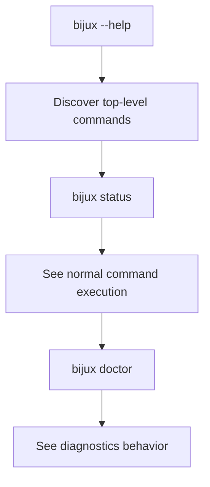
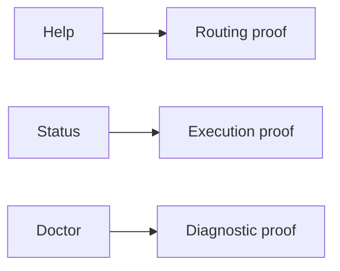

# Run Your First Commands

## Goal

Use a small command set to prove the runtime is alive, reachable, and returning
useful output.





## Minimal Command Set

Run these in order:

```bash
bijux --help
bijux status
bijux doctor
```

## Why These Commands

- `bijux --help` proves the command surface is available
- `bijux status` proves ordinary command execution works
- `bijux doctor` proves diagnostic reporting works and often catches issues that
  `status` alone does not expose

## What Not To Infer Yet

These commands do not prove:

- plugin lifecycle behavior
- configuration file workflows
- REPL behavior
- compatibility with every packaging channel on the machine

## Practical Reading

At this point you should know whether the runtime is usable. You should not yet
assume it is production-ready for automation until you have checked structured
output and any environment-specific constraints.

## Read Next

Continue to [Use Structured Output](use-structured-output.md).
