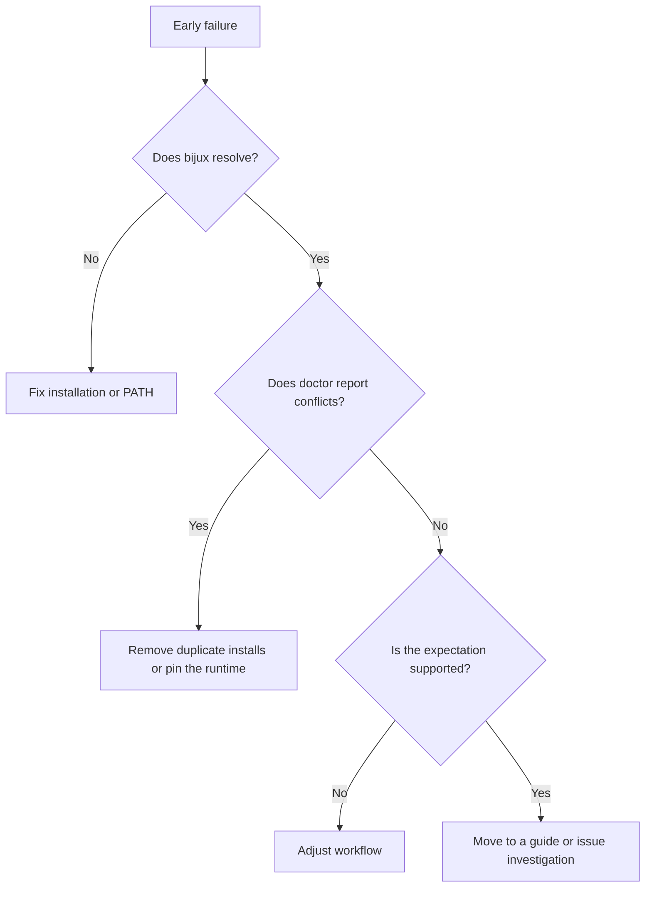
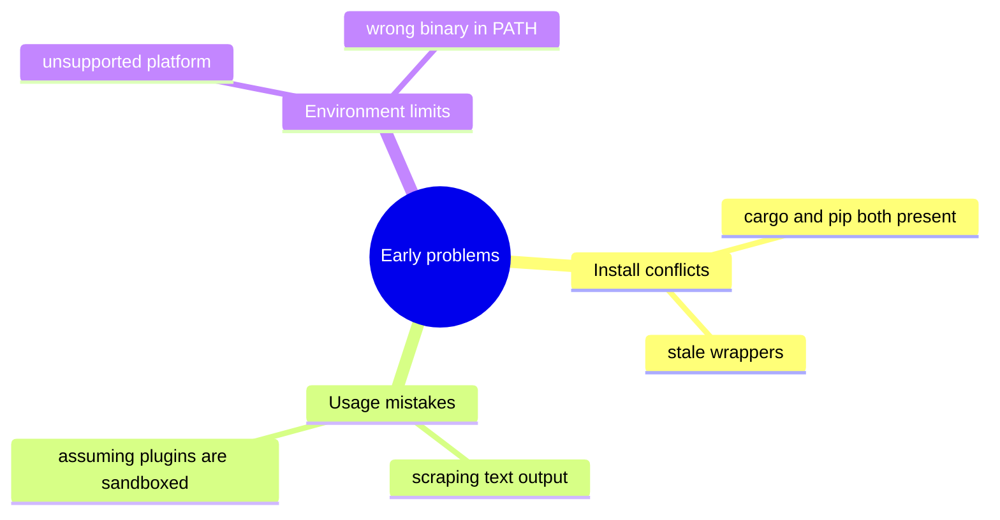

# Troubleshoot Early Problems

## Purpose

Most early failures are not deep runtime bugs. They are usually install
conflicts, path ambiguity, unsupported assumptions, or trying to use a feature
before verifying the basics.





## First Checks

Run:

```bash
bijux version
bijux cli paths
bijux cli doctor
```

These commands are still the fastest way to separate environment problems from
command-level problems.

## Common Real Causes

- more than one `bijux` install exists and the wrong one wins in `PATH`
- a wrapper script or shell cache still points at an older binary
- automation expects text output to stay parser-friendly
- the workflow assumes plugin isolation that Bijux does not provide
- the environment is outside the supported platform envelope

## When To Go Deeper

Move to the fuller docs when the basics are already proven:

- [Installation and recovery](../02-getting-started/installation-and-recovery.md)
- [Command surface](../06-reference/command-surface.md)
- [Configuration and output](../03-user-guide/configuration-and-output.md)
- [Plugins and extensions](../03-user-guide/plugins-and-extensions.md)
- [Status and gaps](../KNOWN_GAPS.md)

## Closing Rule

Fix install identity first, then command behavior, then higher-level workflows.
Skipping that order usually wastes time.
