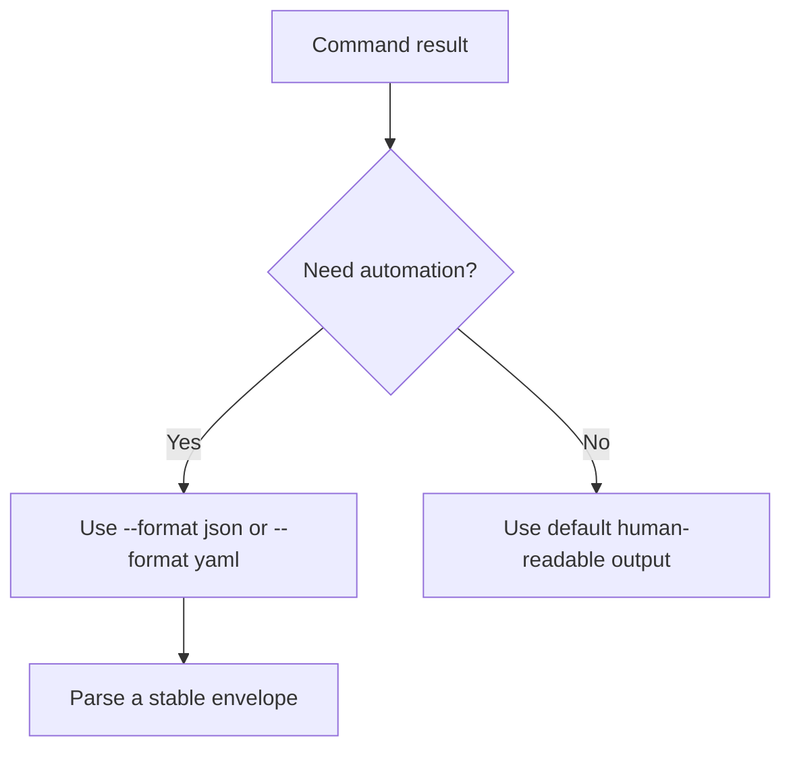
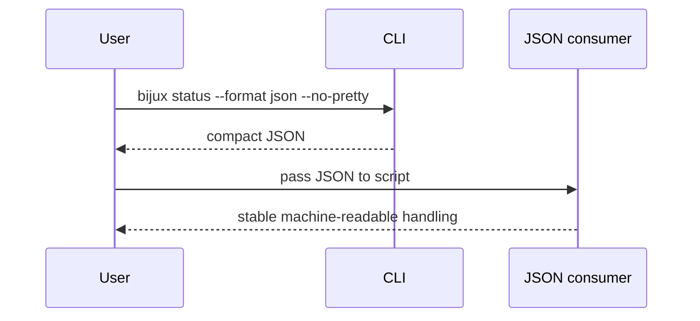

# Use Structured Output

## Goal

Move from human inspection to scriptable behavior. Bijux is most useful when you
request explicit output formats instead of scraping styled terminal text.





## First Structured Command

Run:

```bash
bijux status --format json --no-pretty
```

If you prefer YAML for manual inspection:

```bash
bijux status --format yaml
```

## Working Rule

For automation:

- prefer `json`
- add `--no-pretty` when compact output matters
- rely on exit codes and structured output together

For interactive work:

- human-readable text is fine
- YAML can be useful when reading nested structures manually

## Honest Limit

Structured output improves reliability, but it does not remove the need to
check exit codes. A script that ignores command failure and only parses output
is still brittle.

## Read Next

Continue to [Troubleshoot Early Problems](troubleshoot-early-problems.md).
