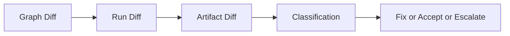

# Diff

Show how to compare graph, run, and artifact behavior using structured diff workflows.

Diff is the main tool for answering "what changed" after drift or regression.

## Explanation
Diff modes:
- graph diff: definition-level changes
- run diff: execution outcome and behavior changes
- artifact diff: output-level changes

Graph diff logic (operator view):
- compares canonical graph semantics, not formatting-only text variance.
- highlights node additions/removals, dependency changes, and semantic configuration drift.
- answers: "did the workflow definition change, and where?"

Run diff logic (operator view):
- compares terminal status, node outcomes, and run-level evidence summaries.
- isolates scope of divergence to specific node/result classes when possible.
- answers: "did execution behavior change under comparable intent?"

Artifact diff logic (operator view):
- compares artifact identities/hashes and relevant metadata.
- classifies output equivalence, drift, or unknown states.
- answers: "did produced outputs change, and is change attributable?"

Diff classification guidance:
- expected change: planned/configured difference
- suspicious change: unplanned and unexplained divergence
- breaking change: contract-relevant mismatch

Canonical reference boundaries:
- this guide explains operator interpretation and workflow.
- canonical diff contract vocabulary is in `docs/06-specification/08-diff-semantics.md`.
- replay-to-diff relationship contract is in `docs/06-specification/07-replay-semantics.md`.

Diff-driven diagnosis pattern:
1. run graph diff first to separate definition drift from runtime drift.
2. run run diff to localize behavioral differences.
3. run artifact diff on critical outputs for release-impact assessment.
4. decide fix/replay/escalation path based on classification severity.

Operational diff workflow:
1. choose comparable entities
2. run appropriate diff command
3. classify each reported difference
4. decide whether replay or remediation is required

## Examples
```bash
# Graph diff
bijux-dag diff graph --left ./pipelines/a.dag.json --right ./pipelines/b.dag.json

# Run diff
bijux-dag diff run --left RUN_20260309_001 --right RUN_20260309_002

# Artifact diff
bijux-dag diff artifact --left ART_001 --right ART_002
```

```text
Real diff example:
graph scope: equivalent
run scope: drift at node "transform" (exit status changed 0 -> 1)
artifact scope: drift for out/result.txt (hash mismatch)
Action:
- inspect node transform diagnostics
- verify input/tooling changes
```



## Guarantees
- Diff usage is documented across graph, run, and artifact scopes.
- Classification guidance is explicit for operational triage.
- Includes practical ordering for graph/run/artifact comparison flow.

## Common Wrong Assumptions
- `equivalent` does not mean every runtime metric (such as timing) is identical.
- `drift` does not automatically mean a breaking release issue; scope and reason code matter.
- `unknown` is not safe-to-ignore; it requires additional evidence before approval decisions.

## Limitations
- Exact field-by-field diff semantics are specified in contract docs.
- This guide does not replace deeper forensic workflows.
- Unknown comparison states require additional evidence and should not be forced into equivalent/breaking buckets.

## Related
- `docs/03-user-guide/05-replay.md`
- `docs/03-user-guide/07-inspect-and-debug.md`
- `docs/06-specification/08-diff-semantics.md`
- `docs/06-specification/01-dag-model.md`

## Start from the operator questions

Use diff in this order to answer the right question quickly:

- `What changed in definition?` -> graph diff.
- `What changed in execution behavior?` -> run diff.
- `What changed in delivered outputs?` -> artifact diff.
- `Does the change matter for release or reproducibility?` -> classification and policy decision.

## Surface-specific examples

Graph diff example:

```bash
bijux-dag diff graph --left ./pipelines/baseline.dag.json --right ./pipelines/candidate.dag.json
```

Run diff example:

```bash
bijux-dag diff run --left RUN_20260309_204 --right RUN_20260309_211
```

Artifact diff example:

```bash
bijux-dag diff artifact --left ART_orders_v1 --right ART_orders_v2
```

Interpret each result independently before rolling them into one release decision.
