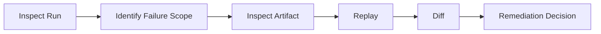

# Inspect And Debug

## Purpose
Provide a practical debugging path using inspect outputs and failure-oriented triage.

## Context
Inspect is the first operational interface for understanding failed or unexpected runs.

## Explanation
Inspect scope:
- run inspect: status, timing, failure summary
- artifact inspect: produced output metadata and lineage context

Debugging mental model:
- inspect gives evidence.
- replay validates repeatability.
- diff classifies divergence.
- do them in that order to avoid premature conclusions.

Debugging path:
1. inspect failing run
2. isolate failing node or divergence area
3. inspect relevant artifacts
4. replay and diff if needed

Failure state interpretation:
- validation failure: DAG or input contract issue
- execution failure: node command/runtime issue
- mismatch failure: replay/diff divergence requiring classification

Failure analysis flow:
1. find first failing node in dependency order.
2. inspect node diagnostics and exit classification.
3. confirm whether expected artifacts were produced.
4. identify whether failure is deterministic (recurs on replay) or environment-specific.
5. decide remediation: DAG fix, command fix, dependency/tooling fix, or baseline update.

Cancellation guidance:
- canceled runs should be treated as incomplete evidence
- compare against last complete run before drawing behavior conclusions

Inspect output signals to focus on:
- terminal status and failure code/class.
- first failing node and upstream dependency context.
- missing artifact references.
- timing outliers indicating environment/tool pressure.

## Examples
```bash
# Inspect failing run
bijux-dag inspect run --run-id RUN_20260309_501

# Inspect artifact associated with failure path
bijux-dag inspect artifact --artifact-id ART_20260309_902

# Continue diagnosis with replay and diff
bijux-dag replay --run-id RUN_20260309_501
bijux-dag diff run --left RUN_20260309_500 --right RUN_20260309_501
```

```text
Artifact inspection example:
- artifact_id: ART_20260309_902
- run_id: RUN_20260309_501
- node_id: transform
- hash: sha256:8ad1...
Interpretation:
- lineage confirms artifact came from failing-path node
```

```text
Failure analysis example:
- run status: failed
- first failing node: transform
- reason class: NODE_EXIT_NONZERO
- missing expected artifact: out/result.txt
next action:
- inspect command stderr
- validate input artifact from prerequisite node
```



## Guarantees
- Debug path is sequential and actionable.
- Inspect guidance is aligned with replay/diff workflows.
- Failure analysis includes concrete evidence signals and decision path.

## Limitations
- This is not a deep incident-management guide.
- Backend-specific failure internals are out of scope.

## Related
- `docs/03-user-guide/04-run-history.md`
- `docs/03-user-guide/05-replay.md`
- `docs/03-user-guide/06-diff.md`
- `docs/07-operations/01-ci-integration.md`
