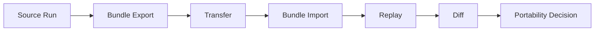

# Bundles And Portability

Explain bundle export/import workflows and portability boundaries with practical validation steps.

Bundles are the handoff mechanism for moving workflow context between environments.

## Explanation
Bundle workflow:
1. export bundle from a known run
2. transfer bundle to target environment
3. import bundle
4. replay and diff against baseline

Bundle content model (operator-level):
- graph identity context
- run evidence references
- artifact references and metadata required for validation workflows
- portability metadata needed for replay/diff interpretation

Export guidance:
- choose a known-good baseline run or an explicitly labeled candidate run.
- record source environment and toolchain context alongside bundle.
- retain checksum/signature metadata if your environment requires integrity verification.

Import guidance:
- import into a clean, known target environment when possible.
- verify bundle integrity before trusting imported context.
- record target environment details before replay.

Portability boundaries:
- portability means transferable workflow context, not universal backend parity
- behavior remains bounded by environment and support matrix constraints

Portability limits and implications:
- equivalent bundle import does not guarantee equivalent runtime timing.
- missing backend capabilities can produce replay incompleteness or drift.
- environment/tool differences can cause bounded divergence that must be classified, not ignored.

End-to-end operator workflow:
```text
Author DAG -> Run -> Export bundle -> Import bundle -> Replay -> Diff -> Decision
```

This workflow is the recommended baseline for release confidence and migration checks.

## Examples
```bash
bijux-dag bundle export --run-id RUN_20260309_120 --out ./exports/run120.bundle
bijux-dag bundle import --bundle ./exports/run120.bundle
bijux-dag replay --run-id RUN_20260309_120
bijux-dag diff run --left RUN_20260309_120 --right RUN_20260309_121
```

```text
Bundle validation example:
source run: RUN_20260309_120
target replay run: RUN_20260309_121
diff result:
- graph: equivalent
- run: equivalent
- artifact: equivalent
decision:
- portability validated for this support envelope
```

```text
Bounded portability mismatch example:
- source backend: local-shell (stable)
- target backend: adapter-X (provisional)
- replay classification: incomplete (missing timeout capability)
decision:
- portability not accepted as equivalent for release gate
```



## Guarantees
- Bundle flow is documented as a complete operational loop.
- Portability limits are explicit and non-speculative.
- Export/import/replay/diff sequence is documented with concrete validation outcomes.

## Limitations
- Does not define low-level bundle schema internals.
- Does not guarantee identical performance across environments.
- Final portability acceptance still depends on backend support tier and operational policy.

## Related
- `docs/03-user-guide/05-replay.md`
- `docs/03-user-guide/06-diff.md`
- `docs/07-operations/05-backend-support.md`
- `docs/06-specification/03-artifact-model.md`
