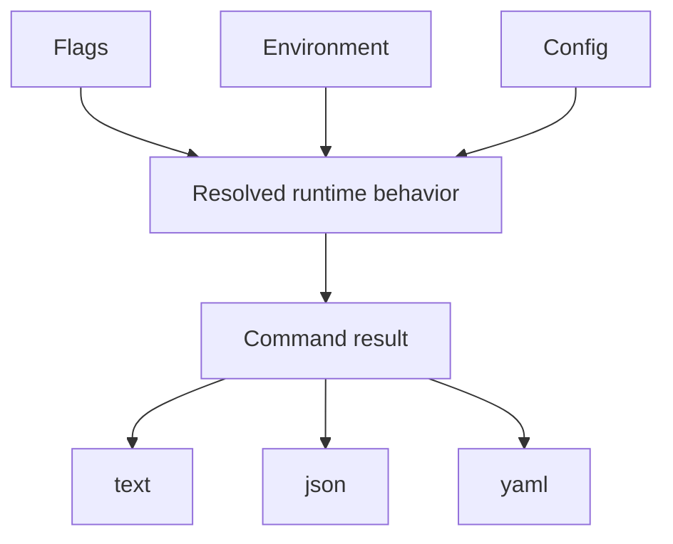
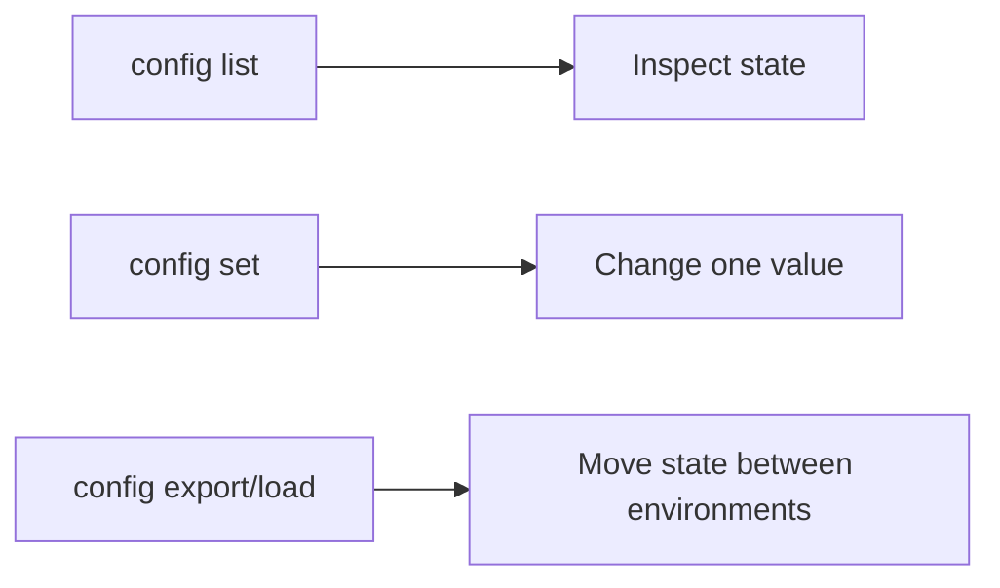

# Configuration And Output

## Goal

Treat runtime state and output format as explicit choices. That is where Bijux
becomes predictable in scripts and repeatable across machines.





## Common Configuration Commands

```bash
bijux config list
bijux config get KEY
bijux config set KEY=VALUE
bijux config unset KEY
bijux config export ./bijux.env
bijux config load ./bijux.env
```

For file handoff, both `export` and `load` return structured confirmation when
you request JSON or YAML:

- `config export PATH --format json --no-pretty` reports `status`, `file`, and
  `file_format`
- `config load PATH --format json --no-pretty` reports `status` and `file`

## Output Rule

For automation, prefer:

```bash
bijux status --format json --no-pretty
```

For interactive reading, YAML can be useful:

```bash
bijux status --format yaml
```

Plain text is also a supported format when you want human-readable output
without JSON or YAML structure:

```bash
bijux status --format text
```

## Practical Guidance

- use `config list` to see the current effective state quickly
- use `export PATH` and `load PATH` when you need file-based handoff
- use `json` for scripts and CI
- check exit codes together with structured output

## Precedence Example

If more than one source defines a value, the runtime resolves it in a fixed
order:

```bash
bijux config set format=yaml
export BIJUXCLI_FORMAT=json
bijux status --format yaml
```

Expected behavior:

- the CLI flag wins over the environment
- the environment wins over config
- defaults apply only when no other source provides a value

This is why explicit flags are the safest choice for automation and CI.

## Honest Limit

Configuration helps control behavior, but it does not override unsupported
workflows or make conflicting installs safe. Use `doctor` when behavior still
looks wrong.

## Read Next

Continue to [Plugins And Extensions](plugins-and-extensions.md).
