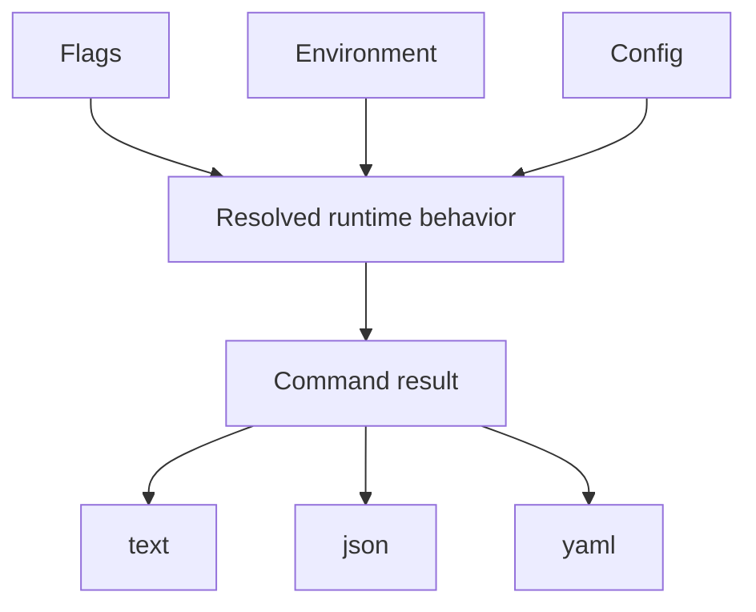
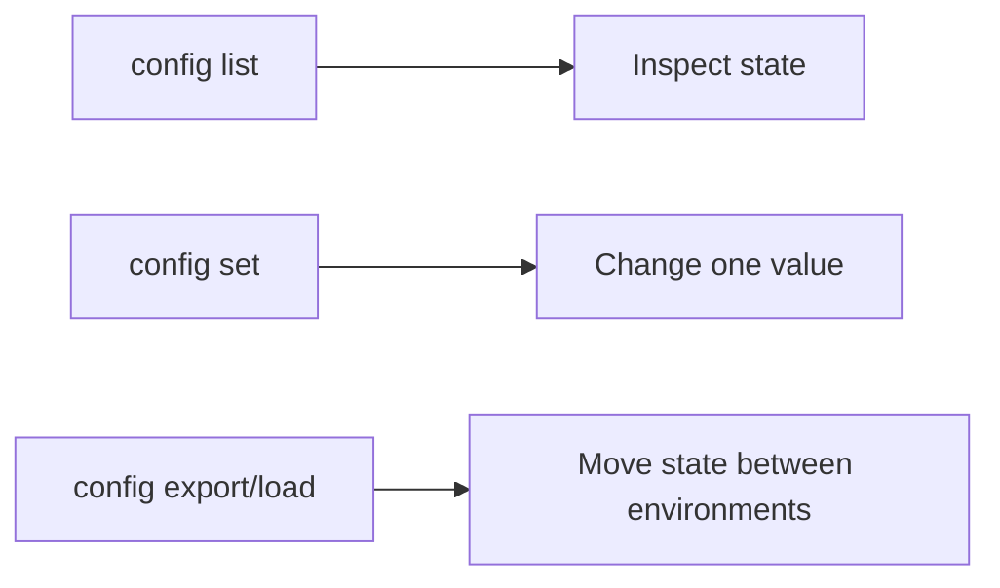

# Configuration And Output

## Goal

Treat runtime state and output format as explicit choices. That is where Bijux
becomes predictable in scripts and repeatable across machines.





## Common Configuration Commands

```bash
bijux cli config list
bijux cli config get KEY
bijux cli config set KEY=VALUE
bijux cli config unset KEY
bijux cli config export ./bijux.env
bijux cli config load ./bijux.env
```

## Output Rule

For automation, prefer:

```bash
bijux status --format json --no-pretty
```

For interactive reading, YAML can be useful:

```bash
bijux status --format yaml
```

## Practical Guidance

- use `config list` to see the current effective state quickly
- use `export` and `load` when you need file-based handoff
- use `json` for scripts and CI
- check exit codes together with structured output

## Precedence Example

If more than one source defines a value, the runtime resolves it in a fixed
order:

```bash
bijux cli config set format=yaml
export BIJUXCLI_FORMAT=json
bijux status --format yaml
```

Expected behavior:

- the CLI flag wins over the environment
- the environment wins over config
- defaults apply only when no other source provides a value

This is why explicit flags are the safest choice for automation and CI.

## Honest Limit

Configuration helps control behavior, but it does not override unsupported
workflows or make conflicting installs safe. Use `doctor` when behavior still
looks wrong.

## Read Next

Continue to [Plugins And Extensions](plugins-and-extensions.md).
