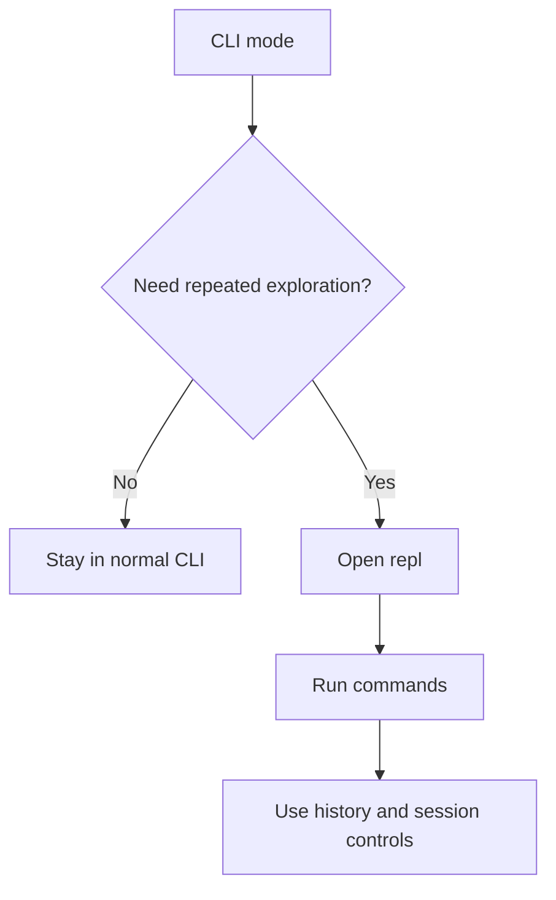
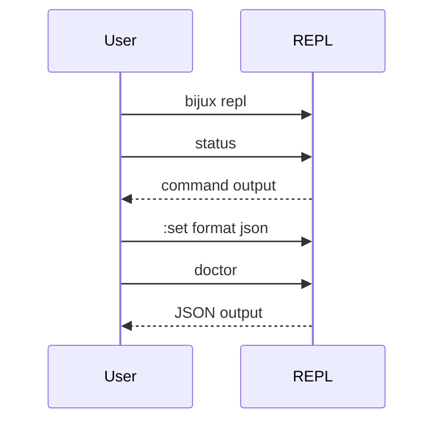

# Interactive Shell And History

## Goal

Use the REPL when interactive exploration is faster than retyping commands in a
new shell process every time.





## Start The REPL

```bash
bijux repl
```

Useful session controls:

- `:help <command>`
- `:set format json|yaml|text`
- `:set quiet on|off`
- `:set trace on|off`
- `:exit`

## History And Repetition

The REPL is useful when:

- you are exploring several related commands
- you want consistent session-local formatting
- you want command history without rebuilding shell pipelines repeatedly

## Honest Limit

The REPL follows the same command law as the CLI, but it is still an
interactive shell. For automation, use normal CLI invocations with explicit
output formats.

## Where To Go Deeper

- [Command surface](../06-reference/command-surface.md)
- [Integrations and routed runtimes](../06-reference/integrations-and-routed-runtimes.md)
- [Routing and surfaces architecture](../04-architecture/routing-and-surfaces.md)
