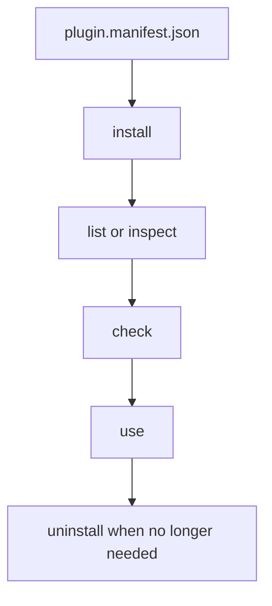
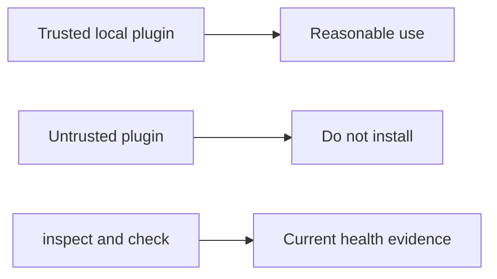

# Plugins And Extensions

## Goal

Use plugins deliberately. The runtime can install, inspect, validate, and
remove plugins, but it does not pretend they are isolated from the host.





## Common Commands

```bash
bijux cli plugins list
bijux cli plugins inspect NAMESPACE
bijux cli plugins install ./plugin.manifest.json
bijux cli plugins check NAMESPACE
bijux cli plugins uninstall NAMESPACE
bijux cli plugins schema
```

## Working Rule

- install from the manifest file
- inspect before assuming a plugin is healthy
- check before relying on a plugin in automation
- uninstall plugins you do not actively want to keep

## Important Limit

Plugins are not sandboxed. Installing a plugin is a trust decision, not just a
feature toggle.

## What The Runtime Can Tell You

`inspect`, `check`, and `doctor` can show compatibility, manifest drift, and
current load issues. They cannot make an untrusted plugin safe.

## Read Next

Continue to [Interactive Shell And History](interactive-shell-and-history.md).
