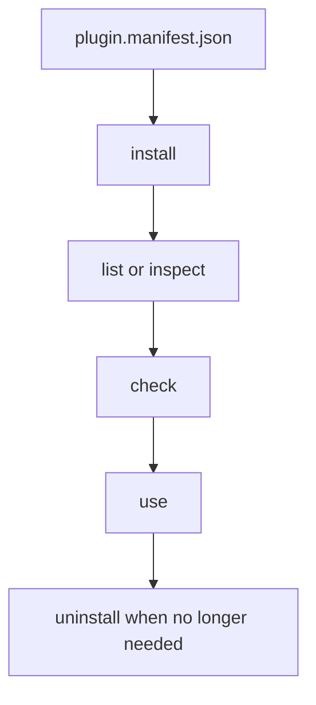
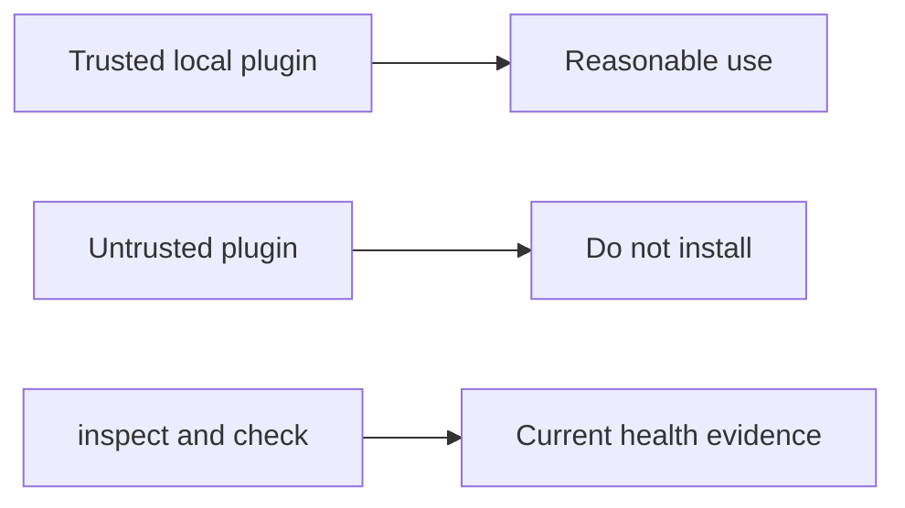

# Plugins And Extensions

## Goal

Use plugins deliberately. The runtime can install, inspect, validate, and
remove plugins, but it does not pretend they are isolated from the host.





## Common Commands

```bash
bijux plugins info
bijux plugins list
bijux plugins inspect
bijux plugins inspect NAMESPACE
bijux plugins install ./plugin.manifest.json
bijux plugins check NAMESPACE
bijux plugins doctor
bijux plugins explain
bijux plugins explain NAMESPACE
bijux plugins where
bijux plugins reserved-names
bijux plugins uninstall NAMESPACE
bijux plugins schema
```

## Minimal Local Plugin Walkthrough

Create a minimal local plugin directory:

```bash
mkdir -p ./my-plugin
cat > ./my-plugin/plugin.manifest.json <<'JSON'
{
  "name": "my-plugin",
  "version": "0.1.0",
  "schema_version": "v2",
  "manifest_version": "v2",
  "compatibility": {
    "min_inclusive": "0.2.1-dev",
    "max_exclusive": "1.0.0"
  },
  "namespace": "my-plugin",
  "kind": "python",
  "aliases": [],
  "entrypoint": "plugin:main",
  "capabilities": []
}
JSON
cat > ./my-plugin/plugin.py <<'PY'
def main(argv: list[str]) -> dict[str, object]:
    return {"status": "ok", "argv": argv}
PY
```

Install, inspect, validate, and remove it:

```bash
bijux plugins info
bijux plugins install ./my-plugin/plugin.manifest.json
bijux plugins list
bijux plugins inspect my-plugin
bijux plugins check my-plugin
bijux plugins doctor
bijux plugins where
bijux plugins reserved-names
bijux plugins explain
bijux plugins explain my-plugin
bijux plugins uninstall my-plugin
```

Expected shape:

- `info` shows overall registry status and plugin inventory details
- `list` includes `my-plugin` after install
- `inspect` without an argument shows the full inventory; with a namespace it
  shows one plugin's manifest, source, and trust metadata
- `check` verifies manifest validity and entrypoint presence
- `doctor` shows registry-wide health and load diagnostics
- `where` shows the active plugins directory and registry file
- `reserved-names` shows the namespaces that plugins must not claim
- `explain` without an argument shows the overall plugin summary; with a
  namespace it shows compatibility or load diagnostics for one plugin
- `list` no longer reports the namespace after uninstall

## Working Rule

- install from the manifest file
- use `reserved-names` before choosing a new namespace or alias
- inspect before assuming a plugin is healthy
- use `doctor` when you need registry-wide health rather than one plugin check
- use `where` when debugging plugin state paths or the active registry file
- check before relying on a plugin in automation
- uninstall plugins you do not actively want to keep

## Current Scope

The current plugin surface is a management and diagnostics surface. These
commands are implemented and supported for baseline use:

- `info`
- `list`
- `inspect`
- `check`
- `enable`
- `disable`
- `install`
- `uninstall`
- `scaffold`
- `doctor`
- `reserved-names`
- `where`
- `explain`
- `schema`

Installed plugin namespaces are not currently executed as direct runtime
subcommands under `bijux`. If your workflow depends on
`bijux <plugin-namespace> ...` execution, that behavior is outside the current
supported surface.

## Important Limit

Plugins are not sandboxed. Installing a plugin is a trust decision, not just a
feature toggle.

## What The Runtime Can Tell You

`inspect`, `check`, `doctor`, and `explain` can show compatibility, manifest
drift, registry-wide health, and current load issues. They cannot make an
untrusted plugin safe.

Rust plugin management already adds guardrails beyond the historical Python
baseline, including better reserved-namespace diagnostics, write-path rollback
coverage, and current-runtime drift reporting.

## Read Next

Continue to [Interactive Shell And History](interactive-shell-and-history.md).
