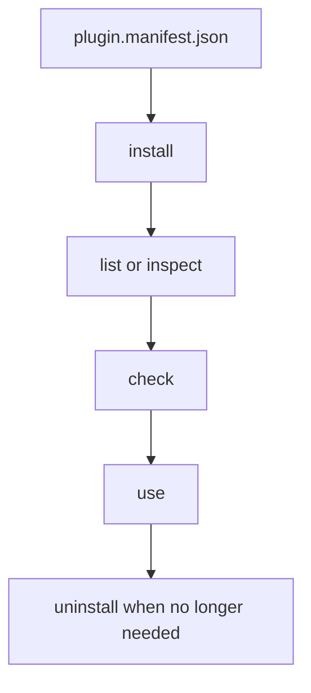
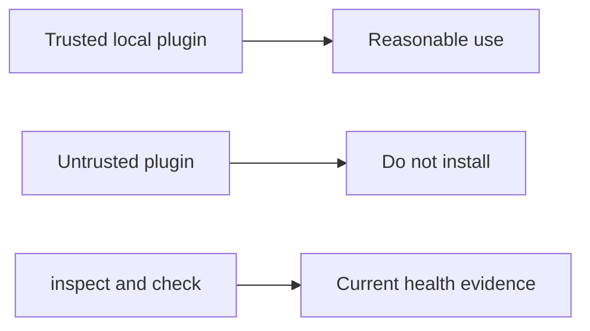

# Plugins And Extensions

## Goal

Use plugins deliberately. The runtime can install, inspect, validate, and
remove plugins, but it does not pretend they are isolated from the host.





## Common Commands

```bash
bijux cli plugins list
bijux cli plugins inspect NAMESPACE
bijux cli plugins install ./plugin.manifest.json
bijux cli plugins check NAMESPACE
bijux cli plugins uninstall NAMESPACE
bijux cli plugins schema
```

## Minimal Local Plugin Walkthrough

Create a minimal local plugin directory:

```bash
mkdir -p ./my-plugin
cat > ./my-plugin/plugin.manifest.json <<'JSON'
{
  "name": "my-plugin",
  "version": "0.1.0",
  "schema_version": "v2",
  "manifest_version": "v2",
  "compatibility": {
    "min_inclusive": "0.2.1-dev",
    "max_exclusive": "1.0.0"
  },
  "namespace": "my-plugin",
  "kind": "python",
  "aliases": [],
  "entrypoint": "plugin:main",
  "capabilities": []
}
JSON
cat > ./my-plugin/plugin.py <<'PY'
def main(argv: list[str]) -> dict[str, object]:
    return {"status": "ok", "argv": argv}
PY
```

Install, inspect, validate, and remove it:

```bash
bijux plugins install ./my-plugin/plugin.manifest.json
bijux plugins list
bijux plugins inspect my-plugin
bijux plugins check my-plugin
bijux plugins explain my-plugin
bijux plugins uninstall my-plugin
```

Expected shape:

- `list` includes `my-plugin` after install
- `inspect` shows manifest, source, and trust metadata
- `check` verifies manifest validity and entrypoint presence
- `explain` shows compatibility or load diagnostics
- `list` no longer reports the namespace after uninstall

## Working Rule

- install from the manifest file
- inspect before assuming a plugin is healthy
- check before relying on a plugin in automation
- uninstall plugins you do not actively want to keep

## Important Limit

Plugins are not sandboxed. Installing a plugin is a trust decision, not just a
feature toggle.

## What The Runtime Can Tell You

`inspect`, `check`, and `doctor` can show compatibility, manifest drift, and
current load issues. They cannot make an untrusted plugin safe.

## Read Next

Continue to [Interactive Shell And History](interactive-shell-and-history.md).
