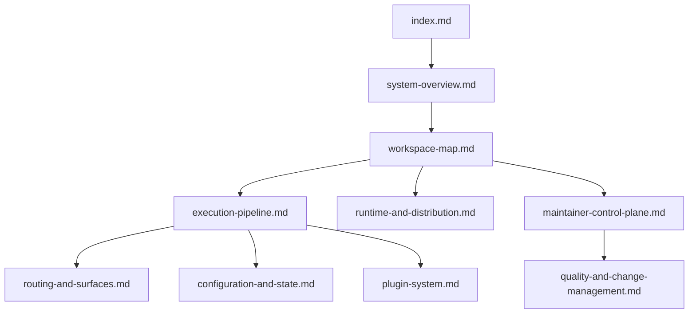
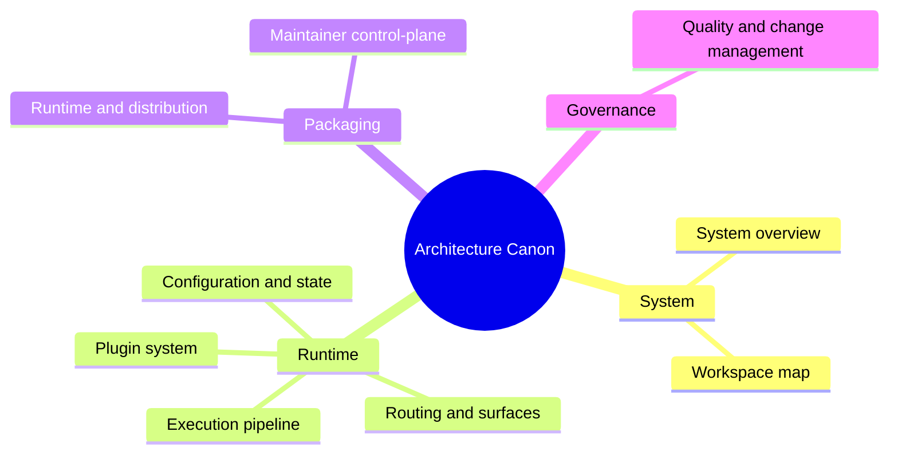

# Architecture

This directory is the current architecture canon for `bijux-cli`.

It replaces the older `docs/architecture/` collection, which had grown into a mix of durable design, migration notes, parity reports, and temporary status writing. The goal here is narrower: keep the smallest set of documents that explains the system accurately.

## What This Set Is

- a description of the current Rust-owned system
- a map of the workspace and its responsibilities
- an explanation of how commands are parsed, executed, and emitted
- a record of the state model, plugin model, packaging model, and maintainer control-plane
- a description of how quality gates and architectural change are handled

## What This Set Is Not

- a migration diary from the older Python-owned runtime
- a progress tracker
- a parity scoreboard
- a replacement for executable tests, schemas, or code-level contracts

## Reading Order

## The Ten Documents

1. [System Overview](system-overview.md)
2. [Workspace Map](workspace-map.md)
3. [Execution Pipeline](execution-pipeline.md)
4. [Routing And Surfaces](routing-and-surfaces.md)
5. [Configuration And State](configuration-and-state.md)
6. [Plugin System](plugin-system.md)
7. [Runtime And Distribution](runtime-and-distribution.md)
8. [Maintainer Control-Plane](maintainer-control-plane.md)
9. [Quality And Change Management](quality-and-change-management.md)
10. [Architecture Index](index.md)

## Source Of Truth

These documents are explanatory, not normative by themselves.

The deeper sources of truth are:

- the Rust source tree under `crates/`
- the contract documents under `docs/constitution/`
- the executable tests
- the published package surfaces

If one of these pages conflicts with the running code or the constitution, the page is wrong and should be corrected.

## Current Architectural Claim

The current claim of this repository is simple:

- `bijux-cli` owns the runtime
- `bijux-cli-python` is a Python-facing packaging and bridge layer around the Rust runtime
- `bijux-dev-cli` is the maintainer control-plane for repository and release diagnostics

That is the architecture being documented here.
