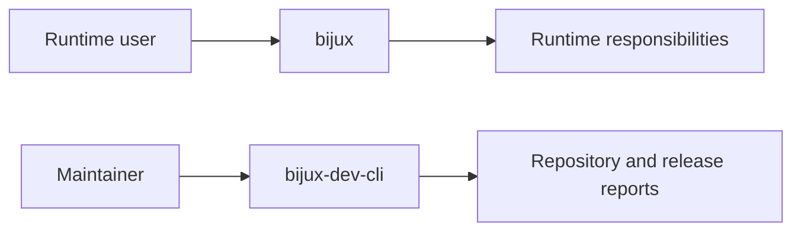
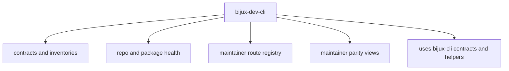
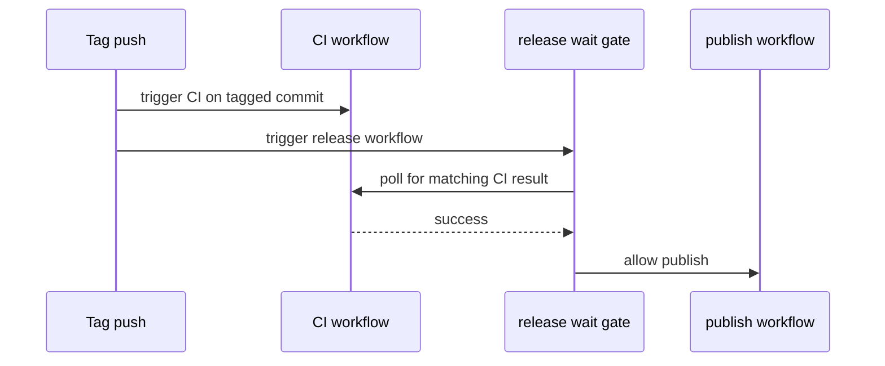
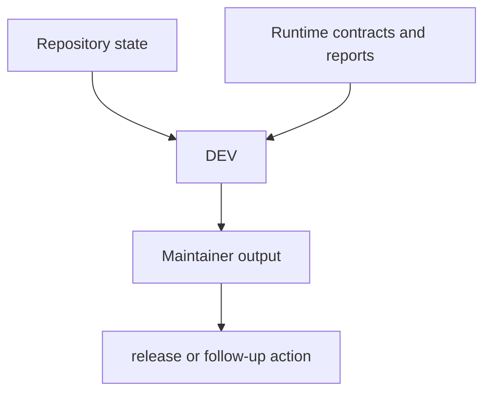

# Maintainer Control-Plane

The maintainer control-plane exists so repository diagnostics and release-facing checks do not have to distort the user-facing runtime.

## Separation

## Why This Crate Exists

Without a separate maintainer control-plane, the runtime binary would accumulate:

- repository-only diagnostics
- release-only gating logic
- documentation audits
- status inventories meant for maintainers rather than users

That would make the user runtime harder to reason about and harder to stabilize.

## Current Responsibilities

The control-plane currently covers:

- repository and package inventories
- maintainer route and contract views
- diagnostics around status, parity, and quality
- release-support logic

## Current Boundary

The maintainer crate depends on the runtime crate.

The runtime crate does not depend on the maintainer crate.

That direction is part of the architecture, not an accident.

## Release Coordination

## Honest Limit

The maintainer control-plane is not a public stability promise at the same level as the end-user CLI. It is valuable, tested, and important, but it is still a maintainer-oriented architecture surface.
