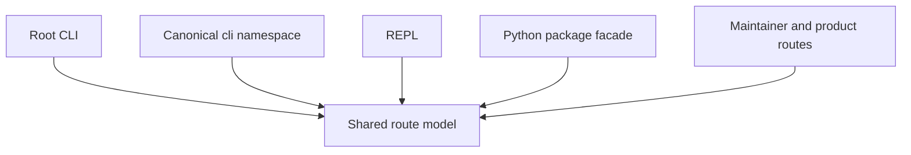
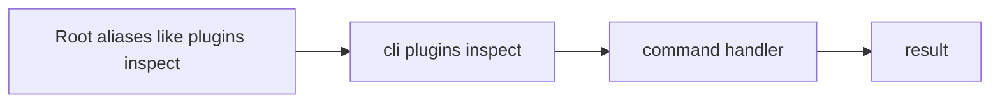
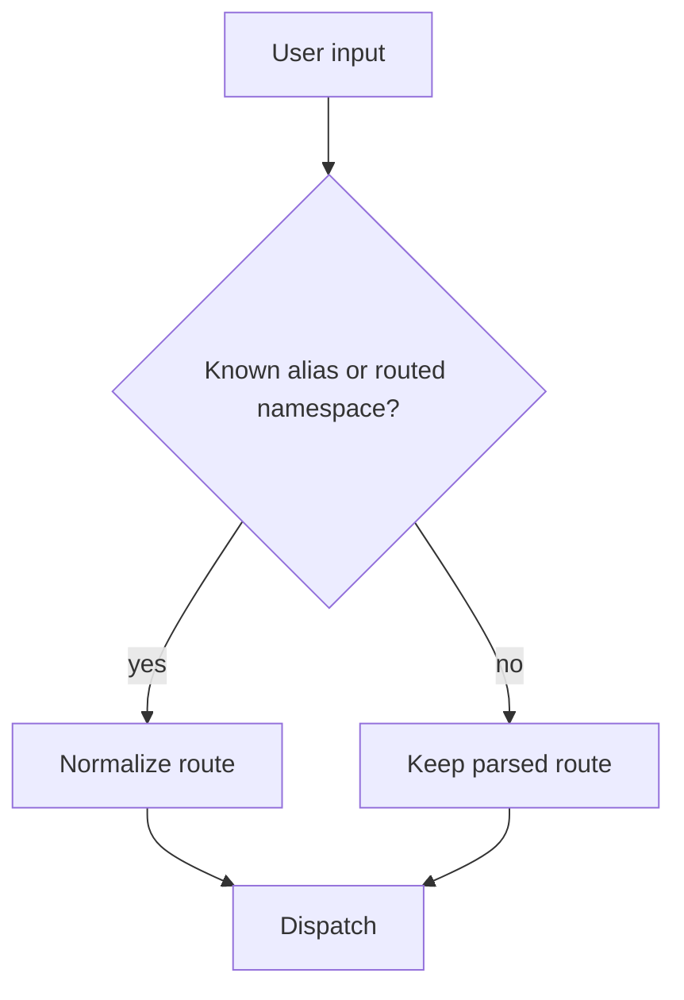
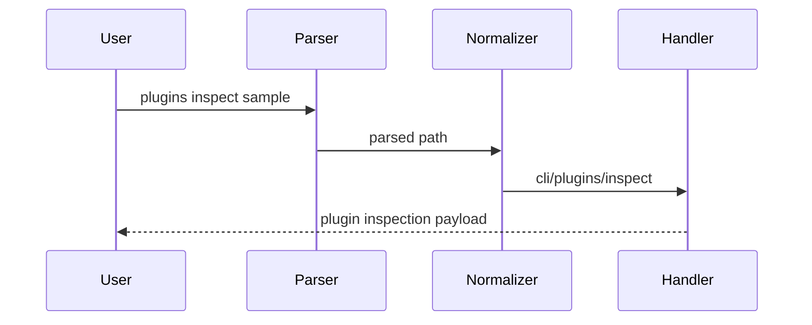

# Routing And Surfaces

The runtime exposes more than one user-facing surface, but they share a common routing model.

## Surfaces

## Current Surfaces

### Root CLI

This is the shortest built-in user-facing surface, for example:

- `bijux status`
- `bijux config list`
- `bijux plugins list`
- `bijux doctor`

### Canonical `cli` Namespace

This is the explicit runtime namespace for routes that either do not exist at
the root or are useful to inspect in their normalized form:

- `bijux cli paths`
- `bijux cli plugins inspect`
- `bijux cli self-test`

The canonical namespace matters because it exposes the normalized route shape
even when shorter root commands also exist.

### Routed Maintainer And Product Surfaces

These are valid routed surfaces, but they are not part of the static built-in
command inventory:

- `bijux dev cli ...` for the maintainer control-plane
- `bijux <product> ...` for adjacent Bijux products when the matching runtime
  binary is available and allowed

### REPL

The REPL is an interface, not a separate architecture.

It uses the same routing and execution model as the CLI as far as practical.

### Python Package Facade

The Python package is a distribution surface that calls into the Rust runtime or its bridge layer. It is not the authoritative source of routing rules.

## Alias Policy

## Help Surface

Help is part of the routed surface, not an afterthought.

The project treats help output as a contract because:

- users rely on it as the first explanation of the command surface
- snapshot tests catch accidental drift
- bad examples in help become real usability defects

## Honest Boundary

The route model is shared, but not every route is equal:

- some routes are public runtime behavior
- some routes are normalized compatibility aliases
- some routes are routed product or maintainer namespaces

The architecture works because those categories are kept separate in code and documentation.
