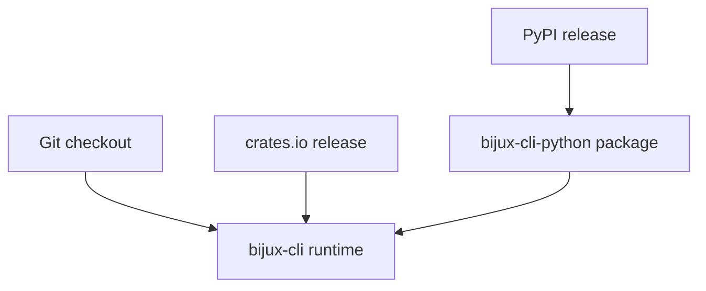
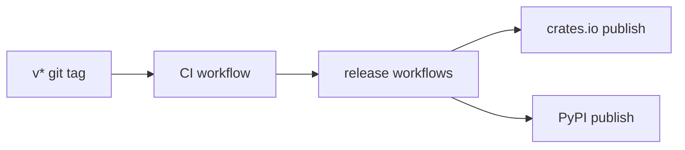
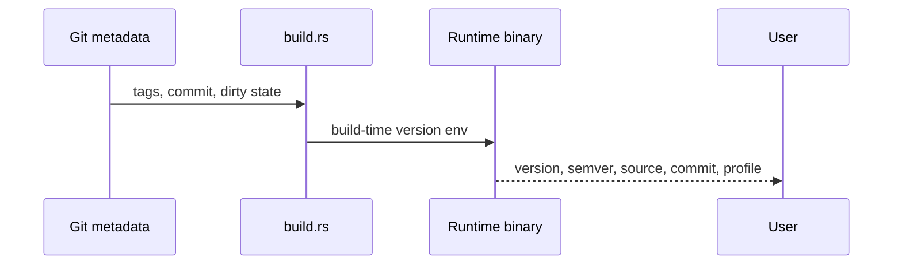
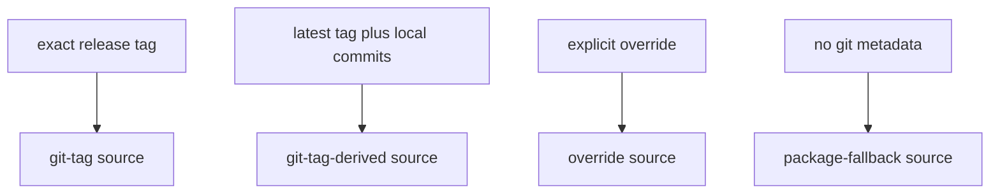

# Runtime And Distribution

The repository publishes more than one install surface, but they all revolve around one runtime ownership model.

## Distribution Surfaces

This diagram shows the current distribution surfaces at a glance. A checkout, a
crates.io install, and a PyPI install do not all look the same to the user, but
they are still organized around one runtime ownership model.

The second diagram explains the release path itself. Tagged releases flow
through CI and the publish workflows, which is why the repo treats release
automation as part of the distribution contract.

## Version Model

The runtime version model is intentionally split:

- display version tracks the latest released git tag line, for example `vX.Y.Z+dev...`
- compatibility semver for a development build moves onto the next patch line from that latest real tag, for example `X.Y.(Z+1)-dev...`
- workspace package manifests may move ahead for release preparation, but untagged runtime builds do not present that newer line as the shipped runtime version
- release workflows stamp the exact tag version into a temporary release tree so published artifacts match the tag without forcing release-only manifest edits into the main branch

This split exists because a development checkout should not claim to be the next published release before the repository has an actual release tag for it.

## Packaging Roles

### Crates

`bijux-cli` is the runtime crate.

`bijux-dev-cli` is the maintainer diagnostics crate. It is a workspace-owned
maintainer package. The current workspace manifest keeps it `publish = false`,
so runtime alias resolution such as `bijux install dev-cli --dry-run` should be
read as package-name resolution, not as a guarantee that a public crates.io
release channel exists.

### Python Package

`bijux-cli-python` is the Python-facing distribution and bridge layer.

It does not define a separate command language from the Rust runtime.

## Current Compatibility Story

The repository keeps two explicit compatibility checks:

- current `bijux-cli` versus current `bijux-cli-python`
- current `bijux-cli-python` versus the repository's configured stable PyPI
  baseline used by the parity suite

That is narrower and more honest than keeping a large archive of checked-in behavior snapshots and pretending they are the architecture.

## Runtime Identity Flow

This sequence shows where runtime identity comes from at build time. Git
metadata is turned into the version data the binary reports, which is why tag
provenance matters for honest version output.

The final diagram summarizes the runtime version sources. It clarifies how
tagged builds, derived development builds, explicit overrides, and package
fallbacks are kept distinct in the reported version metadata.

## Honest Constraint

The repository still supports multiple installation channels. That adds operational complexity, but it is preferable to pretending the Python package or the Rust crate is the only surface users will touch.
