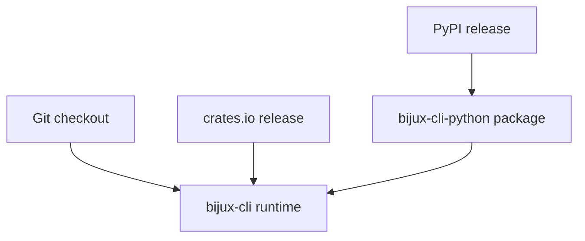
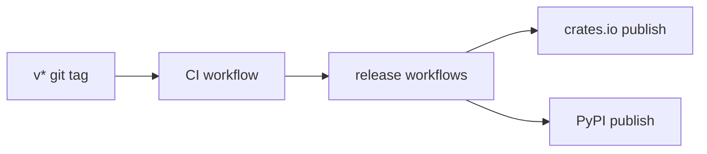
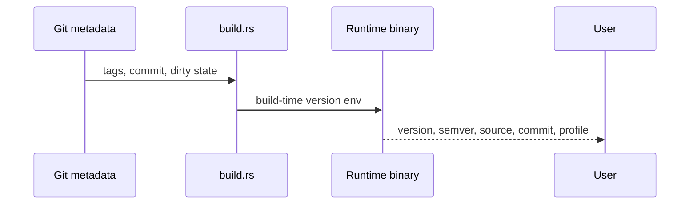
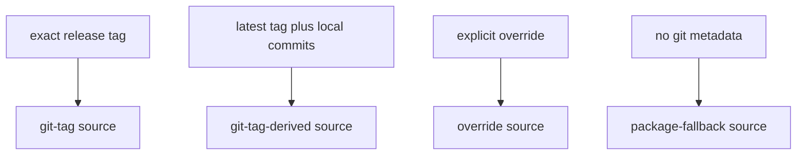

# Runtime And Distribution

The repository publishes more than one install surface, but they all revolve around one runtime ownership model.

## Distribution Surfaces

## Version Model

The runtime version model is intentionally split:

- display version tracks the latest released tag line, for example `v0.2.0+dev...`
- compatibility semver for a development build moves onto the next patch line, for example `0.2.1-dev...`

This split exists because a development checkout should not claim to be the exact published release while still needing an honest semver for compatibility checks.

## Packaging Roles

### Crates

`bijux-cli` is the runtime crate.

`bijux-dev-cli` is the maintainer diagnostics crate.

### Python Package

`bijux-cli-python` is the Python-facing distribution and bridge layer.

It does not define a separate command language from the Rust runtime.

## Current Compatibility Story

The repository keeps two explicit compatibility checks:

- current `bijux-cli` versus current `bijux-cli-python`
- current `bijux-cli-python` versus the latest stable PyPI release line

That is narrower and more honest than keeping a large archive of checked-in behavior snapshots and pretending they are the architecture.

## Runtime Identity Flow

## Honest Constraint

The repository still supports multiple installation channels. That adds operational complexity, but it is preferable to pretending the Python package or the Rust crate is the only surface users will touch.
