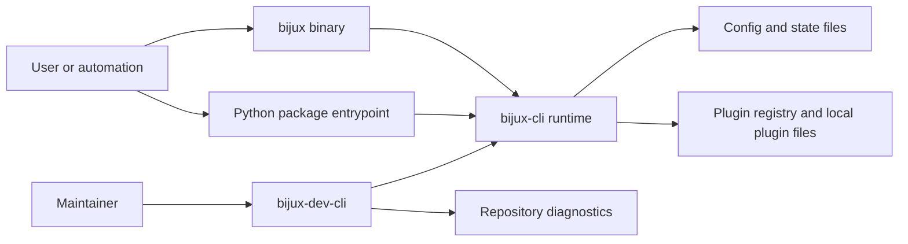
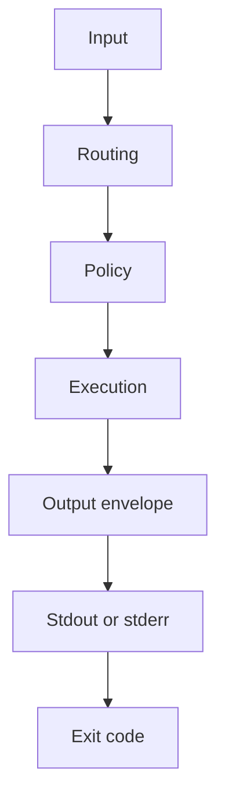
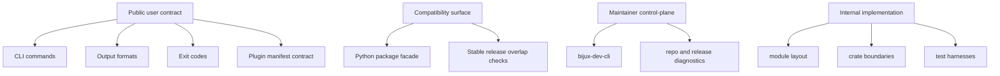
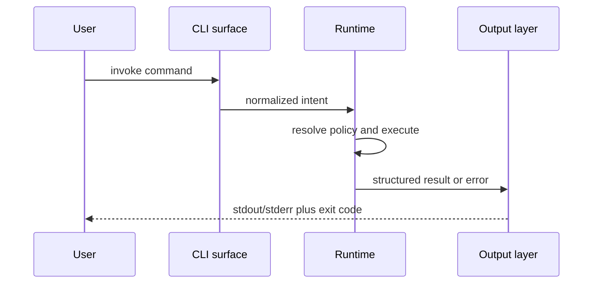

# System Overview

`bijux-cli` is a Rust-owned command runtime with Python packaging and maintainer-facing support crates around it.

The project is no longer best understood as "a Python CLI being ported." The current system is already centered on the Rust runtime. Python remains important, but mainly as a packaging surface and compatibility surface.

## Core Shape

## What The Runtime Owns

The runtime owns:

- command parsing and route normalization
- policy resolution for global flags
- execution semantics
- output formatting
- exit behavior
- configuration and state-path resolution
- plugin installation, inspection, and health checks
- REPL behavior

## What The Runtime Does Not Claim

The runtime does not currently claim:

- sandboxed plugin execution
- an in-process stable plugin ABI
- Windows support
- full removal of Python-facing compatibility surfaces
- that every maintainer-facing report is part of the public user contract

## Design Priorities

The architecture is optimized for:

- determinism over convenience magic
- explicit state over hidden side effects
- executable contracts over prose-only claims
- Rust runtime ownership with thin packaging wrappers
- stable command behavior even while internal implementation changes

## Non-Priorities

The system intentionally does not optimize for:

- plugin isolation
- dynamic runtime mutation without validation
- broad platform abstraction at any cost
- preserving every historical implementation detail from earlier Python ownership

## Public And Internal Surfaces

## Honest Status

The architecture is coherent, but it is not minimal by accident. Some complexity is deliberate:

- the repository still carries multiple distribution surfaces
- the plugin system has real lifecycle and filesystem concerns
- the maintainer control-plane is intentionally separate from the end-user runtime

That complexity should be documented directly, not hidden behind slogans about elegance.
