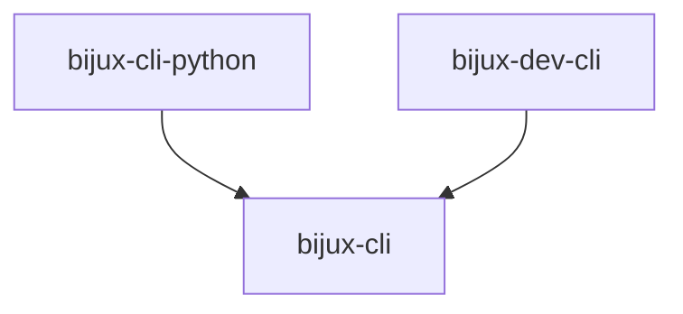
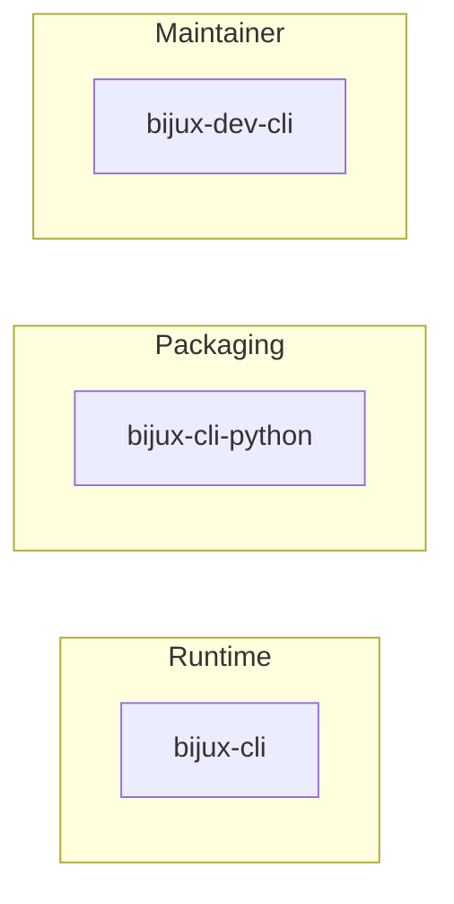
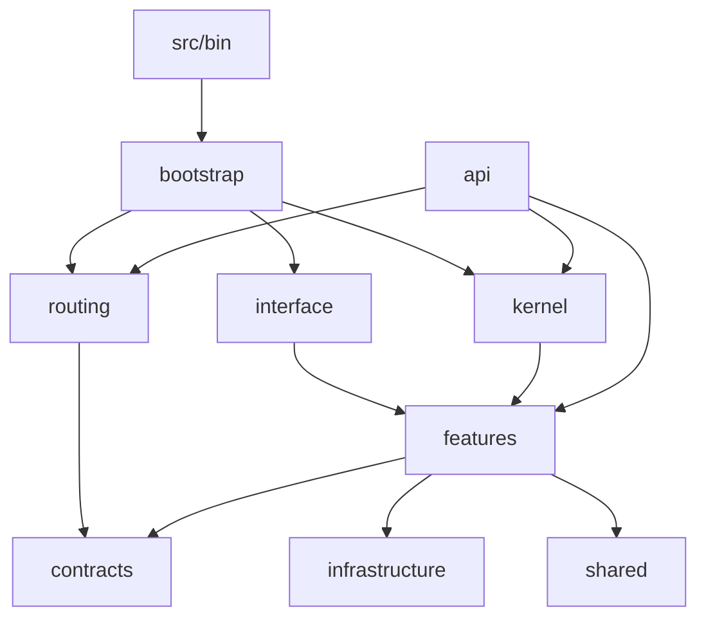
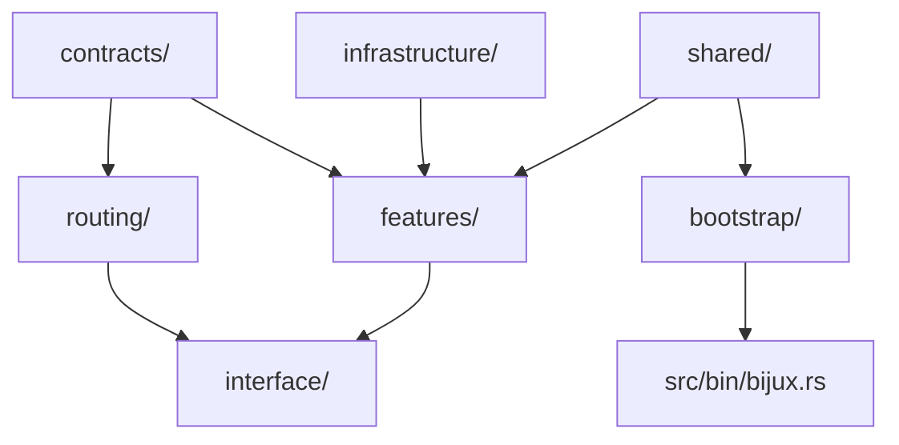

# Workspace Map

The workspace is small in crate count but not trivial in responsibility. Each crate has a narrow architectural role.

## Crates

## Responsibilities

### `crates/bijux-cli`

This is the runtime crate.

It owns:

- the `bijux` binary
- contracts, routing, kernel, interfaces, shared helpers, and features
- the runtime version model
- the plugin, REPL, config, output, diagnostics, and state behavior

### `crates/bijux-cli-python`

This is the Python-facing bridge and package surface.

It owns:

- the Python package entrypoint
- the optional native extension bridge
- Python-facing tests for package behavior and compatibility overlap

It does not redefine the runtime contract independently from the Rust crate.

### `crates/bijux-dev-cli`

This is the maintainer control-plane.

It owns:

- repository diagnostics
- maintainer reports and inventories
- release and parity support commands intended for maintainers rather than ordinary runtime users

## `bijux-cli` Internal Layers

## Why The Split Matters

This split prevents three common failures:

- packaging logic becoming the runtime
- maintainer diagnostics leaking into the user contract by accident
- the core runtime depending on Python or repository-only behavior

## Current Constraint

The crate graph is intentionally one-way:

- `bijux-cli` does not depend on `bijux-cli-python`
- `bijux-cli` does not depend on `bijux-dev-cli`

That direction keeps the runtime central and reusable.

## Honest Tradeoff

The workspace is not "micro-crate" architecture. Most runtime behavior still lives inside `bijux-cli`. That is a conscious tradeoff toward directness over fragmentation.
