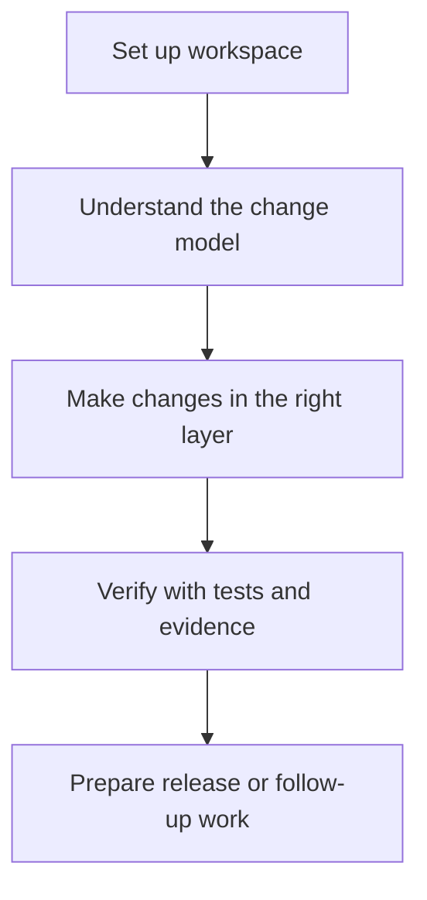
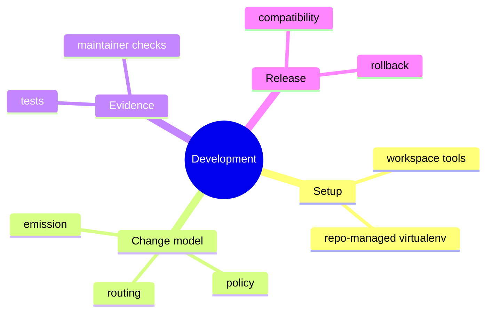

# Development

## Purpose

This section is the canonical development guide for work inside this repository.
It is for contributors changing code, tests, docs, or release behavior.

## Read This Set In Order

1. [Workspace And Tooling](workspace-and-tooling.md)
2. [Change Model](change-model.md)
3. [Testing And Evidence](testing-and-evidence.md)
4. [Release And Compatibility](release-and-compatibility.md)

## Scope

These pages are intentionally narrow:

- they describe the current contributor workflow
- they prefer enforceable rules over broad aspiration
- they point to architecture and contracts only when deeper detail is needed

## Collaboration Standard

Contributors are expected to keep project spaces respectful, direct, and safe
to participate in.

- show empathy, kindness, and professional respect
- give concrete feedback without personal attacks or intimidation
- do not harass, discriminate, stalk, or publish private information without
  permission
- do not retaliate against someone for reporting a concern

These expectations apply in the repository, issues, discussions, chat, and
other public project spaces where someone is representing Bijux. Report serious
conduct concerns to `mousavi.bijan@gmail.com`. Maintainers may moderate
participation, remove contributions, or limit access when behavior is not
compatible with these rules.

## Next Step

If you only need to use the CLI, go to [User Guide](../03-user-guide/index.md).
If you are contributing, start with
[Workspace And Tooling](workspace-and-tooling.md).
