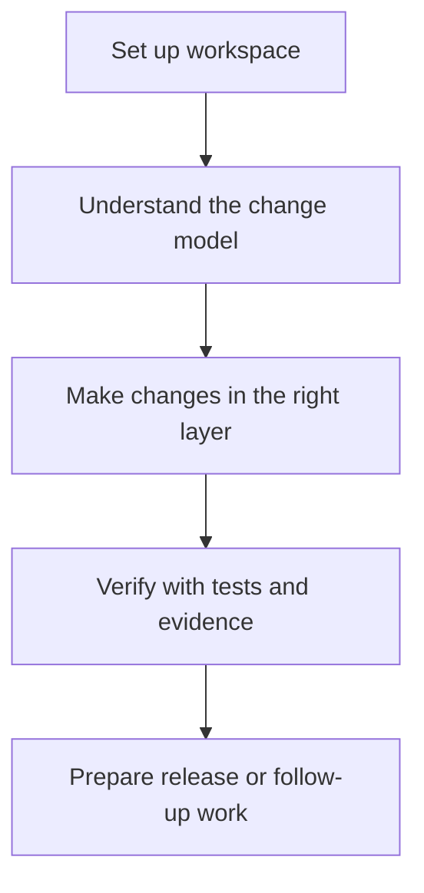
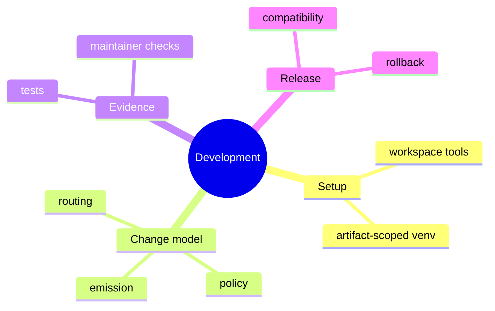

# Development

## Purpose

This section is the canonical development guide for work inside this repository.
It is for contributors changing code, tests, docs, or release behavior.

## Read This Set In Order

1. [Workspace And Tooling](workspace-and-tooling.md)
2. [Change Model](change-model.md)
3. [Testing And Evidence](testing-and-evidence.md)
4. [Release And Compatibility](release-and-compatibility.md)

## Scope

These pages are intentionally narrow:

- they describe the current contributor workflow
- they prefer enforceable rules over broad aspiration
- they point to architecture and constitutions only when deeper detail is needed

## Next Step

If you only need to use the CLI, go to [User Guide](../03-user-guide/index.md).
If you are contributing, start with
[Workspace And Tooling](workspace-and-tooling.md).
