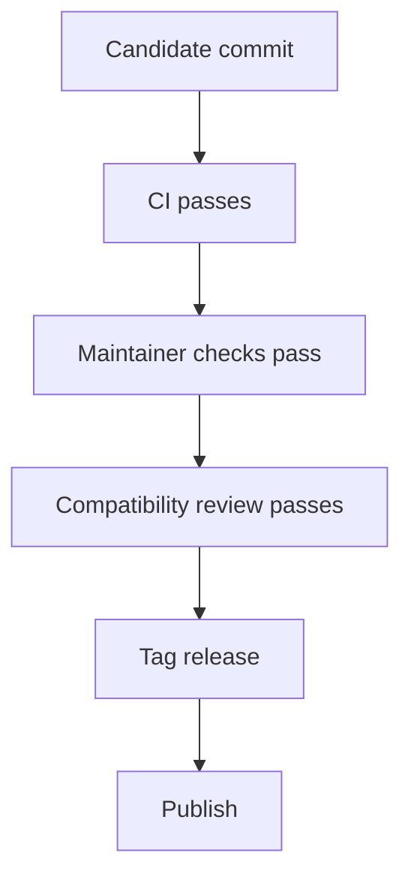
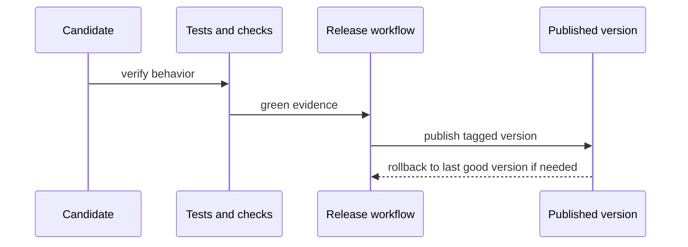

# Release And Compatibility

## Goal

Ship from verified state, keep compatibility reasoning explicit, and make
rollback practical when a release is wrong.





## Release Rules

- release from a clean, verified commit
- prefer the repository workflows over manual publish sequences
- check runtime identity and compatibility before tagging
- keep rollback tied to released versions, not local artifacts

## Common Review Commands

```bash
cargo test --locked --workspace
python3 -m pytest crates/bijux-cli-python/tests/python/test_runtime_parity.py
BIJUX_ENABLE_STABLE_PYPI_PARITY=1 python3 -m pytest -m nightly crates/bijux-cli-python/tests/python/test_stable_release_compatibility.py
bijux dev cli status --format json --no-pretty
bijux dev cli parity --format json --no-pretty
make docs-check
```

## Compatibility Standard

The Rust runtime owns current behavior. Compatibility review still matters in
two directions:

- current `bijux-cli` vs current `bijux-cli-python`
- current `bijux-cli-python` vs the latest stable PyPI release line that is
  still treated as the compatibility baseline

## Honest Limit

A green release checklist is not a guarantee that no regression exists. It is a
claim that the current evidence supports shipping more than delaying.

## Where To Go Deeper

- [Quality and change management](../10-architecture/quality-and-change-management.md)
- [Runtime and distribution](../10-architecture/runtime-and-distribution.md)
- [Migrating from Python core](../MIGRATING_FROM_PYTHON_CORE.md)
