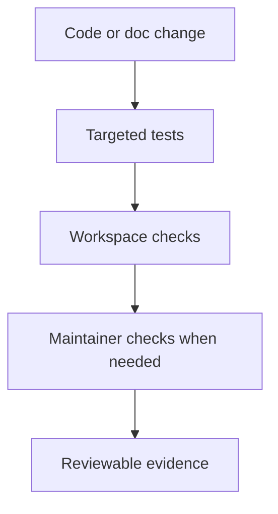
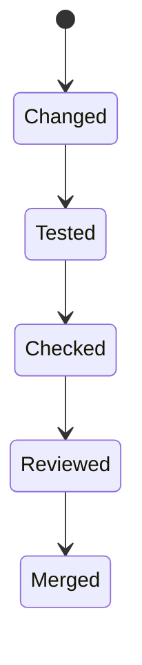

# Testing And Evidence

## Goal

Tie claims to evidence. This repository should not rely on confidence language
when current tests or maintainer checks can answer the question directly.





## Evidence Rules

- do not describe work as done if the relevant tests are red or missing
- generated artifacts are disposable outputs, not repository truth
- prefer live tests and maintainer commands over hand-maintained status prose
- if a public behavior changed, update the tests and docs that describe it

## Claim Discipline

- treat missing evidence as an open gap, not an implicit success
- review `bijux-dev-cli status --format json --no-pretty` before making current
  maintainer status claims
- if parity, docs, or diagnostics still report `partial`, `missing`, or
  equivalent blockers, say that directly instead of rounding it up to done

## Stability Review

Treat a surface as stable enough to describe as current only when:

- route behavior and command identity are covered by current tests or contract
  checks
- stdout, stderr, and exit-code behavior are covered where the surface is part
  of the public CLI
- install, plugin, or state diagnostics do not report unresolved blockers for
  that area

Treat a surface as still risky when:

- parity rows are `partial` or `missing`
- lifecycle write paths still rely on unproven recovery behavior
- docs or tests still describe the area as intentionally different or
  unresolved

## Common Verification Commands

```bash
cargo test --locked --workspace
python3 -m pytest crates/bijux-cli-python/tests/python
bijux-dev-cli status --format json --no-pretty
bijux-dev-cli parity --format json --no-pretty
bijux-dev-cli docs-audit --format json --no-pretty
make docs-check
```

## Review Rule

A convincing change explanation should answer:

- what changed
- what evidence proves it
- what still remains uncertain, if anything

For release or review summaries, keep the outcome shape explicit:

1. `done`
2. `left`
3. `blocked` or `deferred`

## Honest Limit

Passing tests do not make every architectural claim true by themselves. Tests
and docs have to agree, and unsupported claims should still be stated as
unsupported.

## Read Next

Continue to [Release And Compatibility](release-and-compatibility.md).
