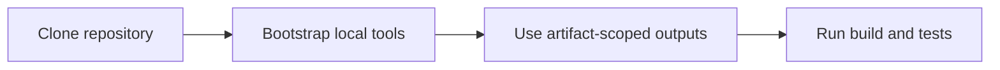
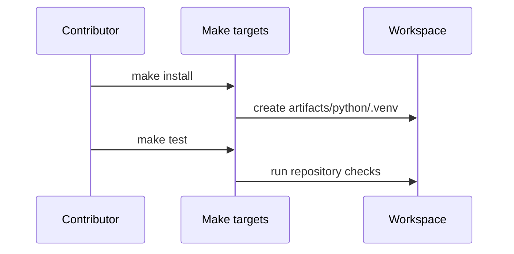

# Workspace And Tooling

## Goal

Get to a working local environment without creating hidden state that only works
on one machine.





## Working Rules

- prefer repository-local tooling over mutable global host state
- keep generated outputs under `artifacts/`
- treat the workspace as a mixed Rust and Python repository, not as two
  unrelated projects
- use the repository entrypoints before inventing local shell shortcuts

## Common Commands

```bash
make install
cargo build --locked --workspace
cargo test --locked --workspace
python3 -m pytest crates/bijux-cli-python/tests/python
make docs-check
```

## Honest Limits

- local success is not enough if CI or maintainer checks would fail
- a globally installed tool can hide missing workspace setup
- deleting `artifacts/` should be safe; if it is not, that is a bug

## Read Next

Continue to [Change Model](change-model.md).
