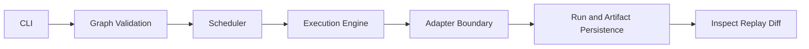

# System Overview

## Purpose
Describe the high-level architecture of bijux-dag and how core subsystems interact.

## Context
This is the architecture entrypoint before subsystem-level details.

## Explanation
Primary architectural domains:
- CLI control surface
- DAG definition and validation layer
- execution engine and scheduler
- adapter boundary for environment/backend execution
- run directory and artifact persistence surfaces
- identity model for graph/run/artifact traceability

Execution flow summary:
1. user submits graph through CLI
2. graph is validated and prepared
3. scheduler derives executable order from dependencies
4. engine executes nodes via appropriate adapters
5. run and artifact evidence is persisted
6. inspect/replay/diff operate over persisted state

System boundary priorities:
- deterministic control over hidden behavior
- explicit operational state over implicit transitions
- traceability over opaque execution outcomes

Architecture tradeoff posture:
- prefer explicit guarantees over broad but unverifiable claims
- prefer stable contract language over roadmap-oriented speculation
- prefer diagnosable evidence surfaces over implicit runtime behavior

Architecture consistency checks:
- terminology in architecture docs must match `docs/01-introduction/05-terminology.md`
- behavior statements in architecture docs must map to specification pages
- architecture pages must not claim unimplemented future capabilities

## Examples
```text
Control flow:
CLI -> Graph validation -> Scheduler -> Engine -> Adapter -> Run/Artifact persistence -> Inspect/Replay/Diff
```



## Guarantees
- System domains and control flow are documented in one coherent model.
- Boundary emphasis aligns with deterministic and inspectable operation goals.
- Architecture documentation explicitly excludes speculative or roadmap claims.

## Limitations
- This document is conceptual; it does not define contracts field-by-field.
- Backend-specific implementation details are documented in dedicated pages.
- Consistency checks are governance expectations and do not replace implementation tests.

## Related
- `docs/05-system-architecture/02-crate-architecture.md`
- `docs/05-system-architecture/03-execution-engine.md`
- `docs/05-system-architecture/04-scheduler.md`
- `docs/05-system-architecture/08-identity-model.md`
