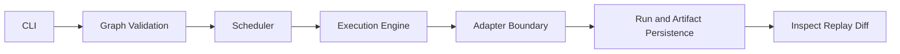
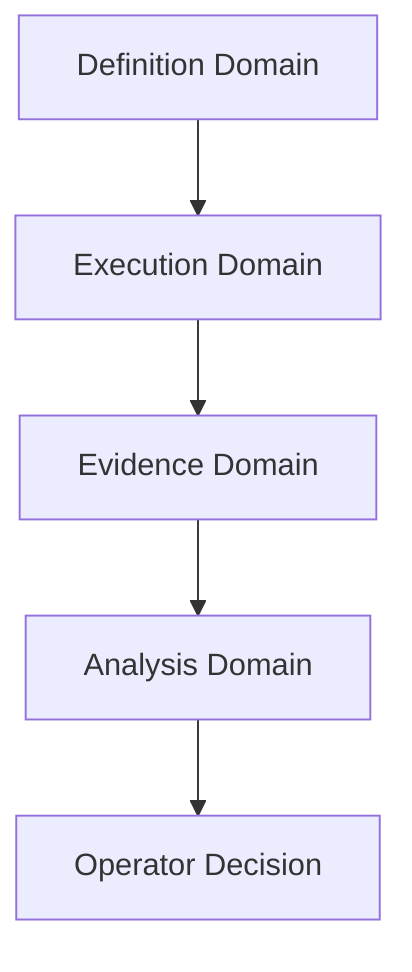
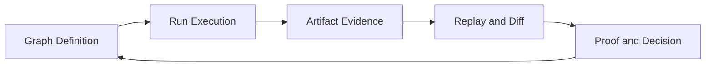
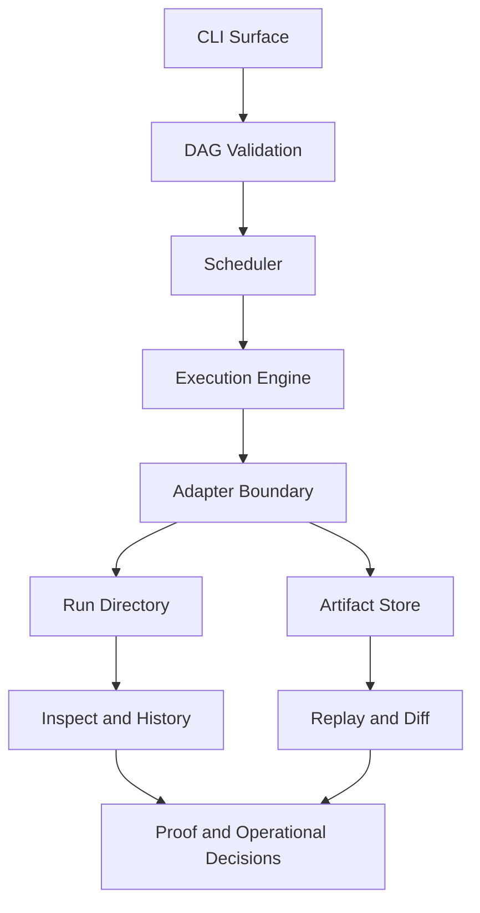

# System Overview

Describe the high-level architecture of bijux-dag and how core subsystems interact.

This is the architecture entrypoint before subsystem-level details.

## Explanation
Primary architectural domains:
- CLI control surface
- DAG definition and validation layer
- execution engine and scheduler
- adapter boundary for environment/backend execution
- run directory and artifact persistence surfaces
- identity model for graph/run/artifact traceability

Execution flow summary:
1. user submits graph through CLI
2. graph is validated and prepared
3. scheduler derives executable order from dependencies
4. engine executes nodes via appropriate adapters
5. run and artifact evidence is persisted
6. inspect/replay/diff operate over persisted state

Execution pipeline interpretation:
- validation stage protects runtime from malformed dependency structures.
- scheduling stage computes legal execution opportunities.
- execution stage produces node outcomes and candidate artifacts.
- persistence stage materializes evidence needed for future diagnosis.
- analysis stage (inspect/replay/diff) transforms evidence into operator decisions.

System boundary priorities:
- deterministic control over hidden behavior
- explicit operational state over implicit transitions
- traceability over opaque execution outcomes

Architecture tradeoff posture:
- prefer explicit guarantees over broad but unverifiable claims
- prefer stable contract language over roadmap-oriented speculation
- prefer diagnosable evidence surfaces over implicit runtime behavior

Architecture consistency checks:
- terminology in architecture docs must match `docs/01-introduction/05-terminology.md`
- behavior statements in architecture docs must map to specification pages
- architecture pages must not claim unimplemented future capabilities

Crate dependency viewpoint (conceptual):
- CLI and user surfaces call into runtime orchestration domains.
- runtime domains depend on adapter boundaries for environment execution.
- runtime and adapter results persist through run/artifact evidence domains.
- replay/diff/inspect consume persisted evidence and identity contracts.

## Examples
```text
Control flow:
CLI -> Graph validation -> Scheduler -> Engine -> Adapter -> Run/Artifact persistence -> Inspect/Replay/Diff
```





## Guarantees
- System domains and control flow are documented in one coherent model.
- Boundary emphasis aligns with deterministic and inspectable operation goals.
- Architecture documentation explicitly excludes speculative or roadmap claims.

## Limitations
- This document is conceptual; it does not define contracts field-by-field.
- Backend-specific implementation details are documented in dedicated pages.
- Consistency checks are governance expectations and do not replace implementation tests.

## Related
- `docs/05-system-architecture/02-crate-architecture.md`
- `docs/05-system-architecture/03-execution-engine.md`
- `docs/05-system-architecture/04-scheduler.md`
- `docs/05-system-architecture/08-identity-model.md`

## Execution truth loop

The core system loop is:

```text
graph definition -> run execution -> artifact evidence -> replay/diff/proof -> operator decision
```

Loop semantics:

- graph definition establishes intended computation semantics.
- run execution records what actually happened.
- artifact evidence captures output identity and lineage.
- replay and diff validate whether behavior remains equivalent or drifted.
- proof-oriented review determines whether confidence is sufficient for acceptance.

This loop is the architectural center of bijux-dag and should anchor both operator workflows and implementation decisions.



## Project orientation diagram

This diagram orients all major architecture surfaces in one view.



## What bijux-dag intentionally excludes

The architecture deliberately does not include:

- long-lived service orchestration concerns unrelated to DAG evidence semantics,
- implicit backend policy engines that mutate runtime guarantees without explicit contracts,
- opaque side-channel state as a substitute for run/artifact evidence.

These exclusions keep guarantees inspectable, bounded, and reproducible.
