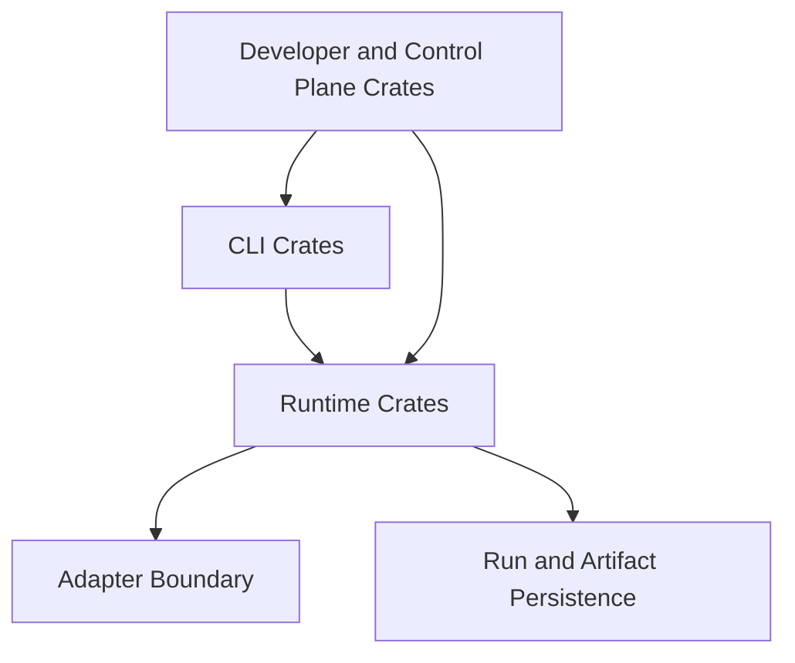

# Crate Architecture

Explain crate-level decomposition and ownership boundaries in the system.

Crate architecture is the structural map for maintainers and contributors.

## Explanation
Crate-level design goals:
- separate stable contracts from implementation details
- keep execution concerns isolated from interface concerns
- keep persistence and identity logic explicit

Responsibility mapping (conceptual):
- CLI crate: command parsing and surface behavior
- runtime crate(s): execution engine, scheduler, and core run behavior
- artifact/storage crate(s): output persistence and retrieval concerns
- development/control-plane tooling crate(s): repository and operational support tooling

Dependency boundary rules (conceptual):
- CLI surfaces should depend downward on runtime contracts, not runtime internals.
- runtime should depend on adapter abstractions, not backend-specific command surfaces.
- storage/evidence concerns should be isolated from command parsing concerns.
- development/control-plane tooling should not redefine runtime semantics contracts.

Crate responsibility rules:
- each crate owns a clear domain boundary
- cross-crate dependencies should follow domain layering
- avoid circular conceptual ownership

Crate architecture quality rules:
- crate documents must use canonical terms from the terminology guide
- crate boundaries must align with active runtime/specification contracts
- crate pages must describe current implemented responsibility, not roadmap intent

Architecture tradeoff:
- tighter crate boundaries increase clarity and maintainability
- tighter boundaries may require explicit integration handoffs between crates

## Examples
```text
Responsibility path example:
cli command -> runtime orchestration -> adapter invocation -> run/artifact persistence
```



## Guarantees
- Crate boundaries are documented in domain terms rather than file-level trivia.
- Ownership mapping is consistent with system overview and execution docs.
- The crate architecture narrative is anchored to implemented system boundaries.

## Limitations
- This page does not enumerate every source file.
- Exact crate graph evolves and should be validated against repository structure docs.
- Cross-crate data contracts are specified in specification documents, not here.

## Related
- `docs/05-system-architecture/01-system-overview.md`
- `docs/05-system-architecture/03-execution-engine.md`
- `docs/08-development/01-repository-structure.md`
- `docs/08-development/03-adapter-development.md`
