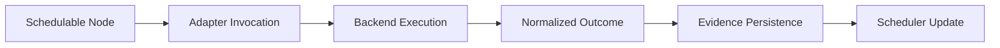

# Execution Engine

Describe how the execution engine runs nodes, handles outcomes, and coordinates with scheduling.

The execution engine is the runtime core that turns DAG plans into concrete run behavior.

## Explanation
Execution engine responsibilities:
- consume scheduler-ready node work units
- execute node commands through adapter/runtime boundaries
- capture success/failure outcomes
- emit state transitions and operational evidence

Engine behavior model:
- node execution follows dependency readiness
- failures are surfaced with diagnosable state
- outputs are handed to artifact persistence surfaces

Execution pipeline decisions:
- engine should not infer hidden dependencies; it consumes scheduler-ready work only.
- engine must return normalized outcome envelopes, not backend-native opaque blobs.
- engine records evidence at each node boundary so post-run diagnosis is possible.

Engine boundary rules:
- engine executes; scheduler orders
- engine records outcomes; history/index surfaces present trends

Deliberate non-goals:
- engine is not a policy layer for cross-backend equivalence decisions
- engine does not redefine adapter capability boundaries
- engine does not treat wall-clock identity as determinism

## Examples
```text
Engine cycle:
receive schedulable node -> execute -> record result -> notify scheduler/state
```



## Guarantees
- Engine responsibilities are separated from scheduler responsibilities.
- Outcome handling is described as explicit stateful behavior.

## Limitations
- This page does not define all runtime state-machine internals.
- Adapter-specific execution details are covered in adapter architecture docs.
- Performance tuning heuristics are outside this architecture baseline.

## Related
- `docs/05-system-architecture/04-scheduler.md`
- `docs/05-system-architecture/05-adapters.md`
- `docs/05-system-architecture/07-run-directory.md`
- `docs/06-specification/02-run-model.md`

## State transitions and evidence recording points

Execution engine transitions should be treated as explicit states with evidence writes at each boundary:

1. `queued` -> node accepted from scheduler frontier
2. `starting` -> adapter invocation prepared and run context bound
3. `running` -> backend execution active
4. `succeeded | failed | canceled` -> terminal outcome normalized
5. `recorded` -> run directory and artifact references persisted

Evidence recording points:

- pre-execution context snapshot (node inputs and dependency status)
- terminal outcome envelope (status, reason class, timings)
- artifact references emitted or missing-output markers

## Engine versus scheduler responsibilities

- scheduler decides when a node is eligible to run.
- engine decides how the eligible node is executed and recorded.
- scheduler updates readiness frontier from engine outcomes.
- engine never reorders dependency semantics.

## Why normalized outcomes matter

Normalized outcomes prevent backend-specific result shapes from leaking into run semantics. They make replay/diff classification stable across adapters and allow incident workflows to compare evidence without backend-specific parsing logic.
