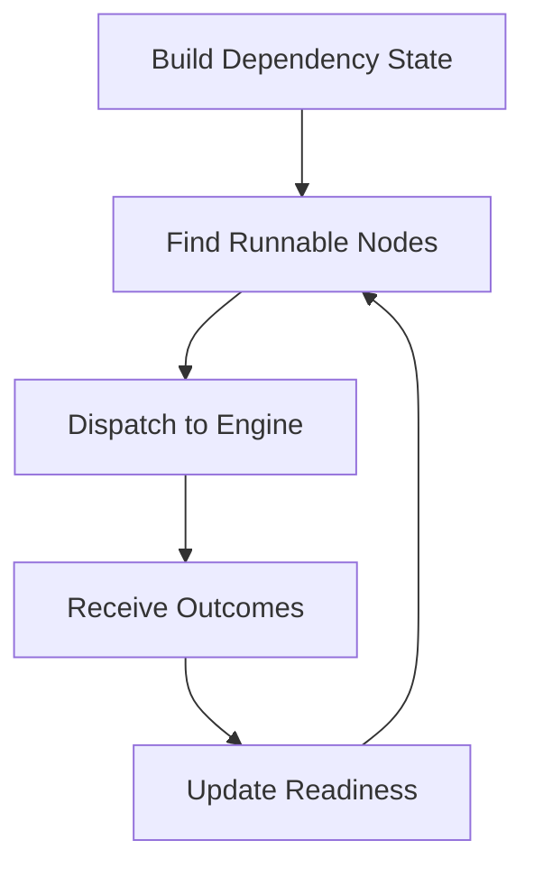

# Scheduler

Explain scheduler design and how dependency constraints become executable order.

Scheduler behavior defines ordering guarantees and concurrency opportunities.

## Explanation
Scheduler responsibilities:
- evaluate dependency graph readiness
- produce next executable node set
- react to node completion/failure events

Design principles:
- strict dependency correctness
- predictable ordering behavior
- clear handling of blocked and failed paths

Scheduler design decisions:
- prefer dependency correctness over maximum concurrency.
- treat blocked nodes as explicit states, not silent skips.
- process completion events incrementally to expose runnable frontier updates.
- preserve deterministic classification semantics even when runnable nodes are concurrent.

Scheduler workflow:
1. build dependency state
2. identify runnable nodes
3. dispatch work to engine
4. update state based on outcomes
5. continue until terminal run state

## Examples
```text
If node C depends on A and B:
- C is not schedulable until both A and B complete successfully.
```



## Guarantees
- Scheduler semantics are described as dependency-correct ordering logic.
- Concurrency is permitted only where dependency constraints allow it.

## Limitations
- This page does not define optimization heuristics or advanced policy tuning.
- Low-level scheduler contract details are specified in specification docs.

## Related
- `docs/05-system-architecture/03-execution-engine.md`
- `docs/03-user-guide/02-dependencies-and-order.md`
- `docs/06-specification/01-dag-model.md`
- `docs/06-specification/02-run-model.md`

## Scheduler goals, fairness, and constraints

Scheduler goals are jointly enforced:

- dependency correctness first,
- deterministic eligibility evaluation,
- fair progress for concurrent-ready nodes,
- explicit terminal classification for blocked branches.

Fairness here means ready nodes are not starved indefinitely when constraints allow dispatch.

## Small-DAG scheduling examples

Example A (fan-out then join):

- `extract` -> `clean_a`
- `extract` -> `clean_b`
- `clean_a` + `clean_b` -> `join`

Scheduling behavior:

- `extract` runs first.
- `clean_a` and `clean_b` become concurrently eligible.
- `join` becomes eligible only after both complete successfully.

Example B (failure propagation):

- `prepare` -> `train`
- `prepare` -> `evaluate`
- `train` -> `publish`

If `train` fails, `publish` remains blocked even if `evaluate` succeeds.

## What the scheduler does not decide

- backend-specific execution mechanics,
- artifact storage policy,
- semantic interpretation of node payload contents,
- portability acceptance decisions.

Those decisions belong to adapters, evidence layers, and operator policy.
