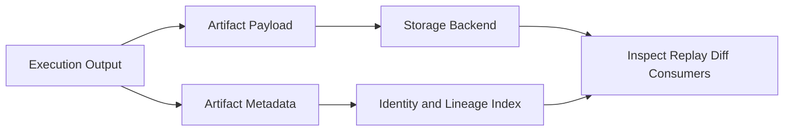

# Artifact Store

Explain artifact store architecture and how outputs are persisted and retrieved.

Artifact store design underpins traceability, diffability, and reproducibility workflows.

## Explanation
Artifact store responsibilities:
- persist artifact payloads and metadata
- expose retrieval by artifact identity
- preserve lineage links to producing run/node context

Architecture principles:
- stable identity-addressable retrieval
- explicit metadata model for auditability
- separation of storage concerns from execution control logic

Storage design decisions:
- artifact payload and metadata are persisted as distinct but linked concerns.
- metadata must include identity and lineage links needed by replay/diff.
- storage indexing favors deterministic lookup by artifact identity and run context.

Operational behavior:
- engine emits artifacts
- store persists and indexes artifacts
- inspect/diff surfaces consume stored artifact data

## Examples
```text
Execution result -> Artifact persistence -> Identity index -> Inspect/Diff consumption
```



## Guarantees
- Artifact persistence and retrieval responsibilities are clearly defined.
- Lineage-aware storage behavior is explicit.

## Limitations
- Backend storage implementation choices are deployment-specific.
- Hash algorithm internals are defined in specification docs.

## Related
- `docs/05-system-architecture/03-execution-engine.md`
- `docs/05-system-architecture/08-identity-model.md`
- `docs/03-user-guide/03-artifacts.md`
- `docs/06-specification/03-artifact-model.md`
