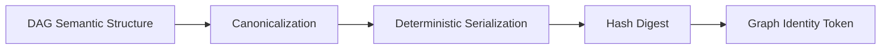

# Identity Model

## Purpose
Explain identity internals for graph, run, and artifact entities, including hashing role.

## Context
Identity modeling is required for deterministic reasoning, replay validation, and diff attribution.

## Explanation
Identity domains:
- graph identity: identifies DAG definition state
- run identity: identifies execution instance
- artifact identity: identifies persisted output object

Identity internals (conceptual):
- identity values are derived from stable, defined inputs
- identity should remain reproducible under equivalent conditions
- identity links establish traceability across graph -> run -> artifact

Graph hashing role:
- graph hashing produces a stable representation of graph definition state
- graph identity changes when graph-defining content changes
- graph hashing enables definition-level comparison and drift detection

Graph hashing algorithm model (contract-facing architecture view):
1. parse DAG definition into semantic structure.
2. canonicalize semantically relevant fields and dependency edges.
3. normalize ordering where ordering is non-semantic.
4. serialize canonical representation deterministically.
5. compute digest using configured hashing algorithm family.
6. emit graph identity token tied to algorithm/canonicalization policy version.

Graph hashing constraints:
- non-semantic formatting changes must not change graph identity.
- semantic dependency or node intent changes must change graph identity.
- hashing policy changes require explicit compatibility governance.

Run and artifact hashing relationship:
- run identity links execution instance context to one graph identity.
- artifact identity links output payload identity to producing run/node lineage.
- replay and diff rely on all three identity surfaces to classify equivalence versus drift.

Identity linkage behavior:
- run records reference graph identity context
- artifacts reference producing run and node context
- replay/diff workflows depend on these links for trustworthy attribution

## Examples
```text
Graph definition change -> graph hash changes -> graph identity changes -> diff classifies definition drift
```



## Guarantees
- Identity domains and their relationships are explicitly defined.
- Graph hashing is documented as a definition-state identity mechanism.
- Graph hashing steps and constraints are explicit at architecture level.

## Limitations
- This page does not define concrete hashing algorithm implementation details.
- Field-level identity contracts are documented in specification docs.

## Related
- `docs/05-system-architecture/01-system-overview.md`
- `docs/05-system-architecture/06-artifact-store.md`
- `docs/06-specification/04-graph-identity.md`
- `docs/06-specification/05-run-identity.md`
- `docs/06-specification/06-artifact-identity.md`
