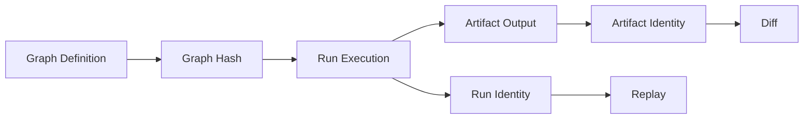
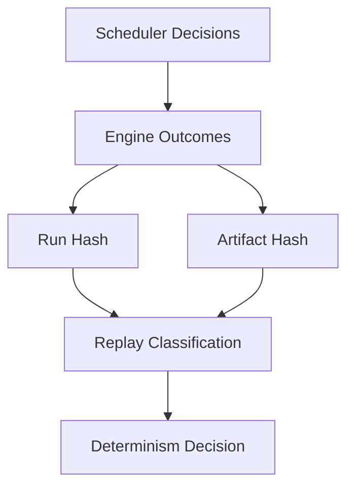

# Determinism

Define determinism architecture guarantees and boundaries for graph, run, and artifact behavior.

Determinism is the core architecture property that enables trustworthy replay and diff workflows.

## Explanation
Determinism in bijux-dag means equivalent defined inputs and graph semantics produce equivalent classified behavior.

Determinism surfaces:
- graph hashing determinism
- run behavior determinism under equivalent context
- artifact identity determinism under equivalent production state

Hashing architecture role:
- graph hashing encodes definition-state identity
- run identity hashing encodes execution-instance identity factors
- artifact identity hashing encodes persisted output identity factors

Run hashing architecture notes:
- run hashing binds execution instance identity to graph context plus run-scoped identity inputs.
- run identity must distinguish repeated attempts over same graph definition.
- run hashing should remain stable for equivalent identity inputs under one hashing policy version.

Artifact hashing architecture notes:
- artifact hashing is computed from canonical artifact content representation.
- artifact identity drift indicates content or canonicalization-input drift.
- artifact hash comparability depends on shared hashing/canonicalization policy version.

Determinism design constraints:
- runtime behavior must minimize hidden mutable state influence
- scheduler ordering semantics must remain dependency-correct and stable
- adapter translations must preserve core runtime semantics where supported

Scheduling determinism notes:
- concurrency is allowed when dependency constraints allow it
- deterministic correctness is about equivalent outcomes and state classification, not wall-clock timing identity

Runtime constraint boundaries:
- environment drift can create bounded non-equivalence
- unsupported backend features can constrain determinism scope

Determinism quality checks (architecture-level):
- classify every non-equivalence explicitly; never collapse unknown into equivalent.
- document determinism assumptions alongside adapter capability boundaries.
- tie replay and diff outcomes to identity surfaces (graph/run/artifact), not ad hoc heuristics.

## Examples
```text
Determinism verification loop:
baseline run -> replay -> diff classification -> confirm equivalent or bounded divergence
```

```text
Run hashing example (conceptual):
graph_id: g_44a...
run_input_context: baseline-A
run_hash: r_9f1...
same graph_id with different run input context -> different run_hash
```

```text
Artifact hashing example (conceptual):
artifact path: out/result.txt
canonical bytes unchanged -> artifact hash unchanged
canonical bytes changed -> artifact hash drift
```





## Guarantees
- Determinism is treated as architecture-level behavior, not documentation-only intent.
- Hashing roles for graph, run, and artifact identity are explicitly defined.
- Determinism boundaries are documented with non-equivalence constraints.
- Run/artifact hashing behavior is described with architecture-level constraints.

## Limitations
- Determinism does not imply universal cross-environment equivalence.
- Exact hashing algorithms and field-level contracts are defined in specification docs.
- Determinism verification quality depends on integrity of run/artifact evidence capture.

## Related
- `docs/05-system-architecture/04-scheduler.md`
- `docs/05-system-architecture/08-identity-model.md`
- `docs/06-specification/04-graph-identity.md`
- `docs/06-specification/05-run-identity.md`
- `docs/06-specification/06-artifact-identity.md`

## Determinism categories in bijux-dag

Determinism is split into three categories:

- deterministic identity: stable graph/run/artifact identity derivation under fixed policy,
- deterministic planning: stable schedulable frontier under equivalent dependency state,
- deterministic execution: stable classified outcomes under equivalent inputs and capability envelope.

## Determinism limits across backends and environments

Determinism is bounded, not absolute:

- capability differences between adapters can reduce equivalence to bounded-equivalent outcomes,
- environment/toolchain drift can alter execution outcomes while preserving graph identity,
- timing/resource variance is expected and not itself determinism failure unless it changes classified outcomes.

Operational implication: determinism claims are only valid inside a declared capability and environment envelope.
