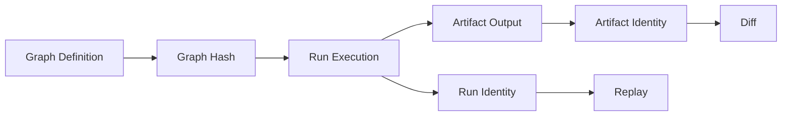

# Determinism

## Purpose
Define determinism architecture guarantees and boundaries for graph, run, and artifact behavior.

## Context
Determinism is the core architecture property that enables trustworthy replay and diff workflows.

## Explanation
Determinism in bijux-dag means equivalent defined inputs and graph semantics produce equivalent classified behavior.

Determinism surfaces:
- graph hashing determinism
- run behavior determinism under equivalent context
- artifact identity determinism under equivalent production state

Hashing architecture role:
- graph hashing encodes definition-state identity
- run identity hashing encodes execution-instance identity factors
- artifact identity hashing encodes persisted output identity factors

Determinism design constraints:
- runtime behavior must minimize hidden mutable state influence
- scheduler ordering semantics must remain dependency-correct and stable
- adapter translations must preserve core runtime semantics where supported

Scheduling determinism notes:
- concurrency is allowed when dependency constraints allow it
- deterministic correctness is about equivalent outcomes and state classification, not wall-clock timing identity

Runtime constraint boundaries:
- environment drift can create bounded non-equivalence
- unsupported backend features can constrain determinism scope

## Examples
```text
Determinism verification loop:
baseline run -> replay -> diff classification -> confirm equivalent or bounded divergence
```



## Guarantees
- Determinism is treated as architecture-level behavior, not documentation-only intent.
- Hashing roles for graph, run, and artifact identity are explicitly defined.
- Determinism boundaries are documented with non-equivalence constraints.

## Limitations
- Determinism does not imply universal cross-environment equivalence.
- Exact hashing algorithms and field-level contracts are defined in specification docs.

## Related
- `docs/05-system-architecture/04-scheduler.md`
- `docs/05-system-architecture/08-identity-model.md`
- `docs/06-specification/04-graph-identity.md`
- `docs/06-specification/05-run-identity.md`
- `docs/06-specification/06-artifact-identity.md`
