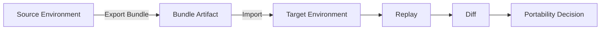
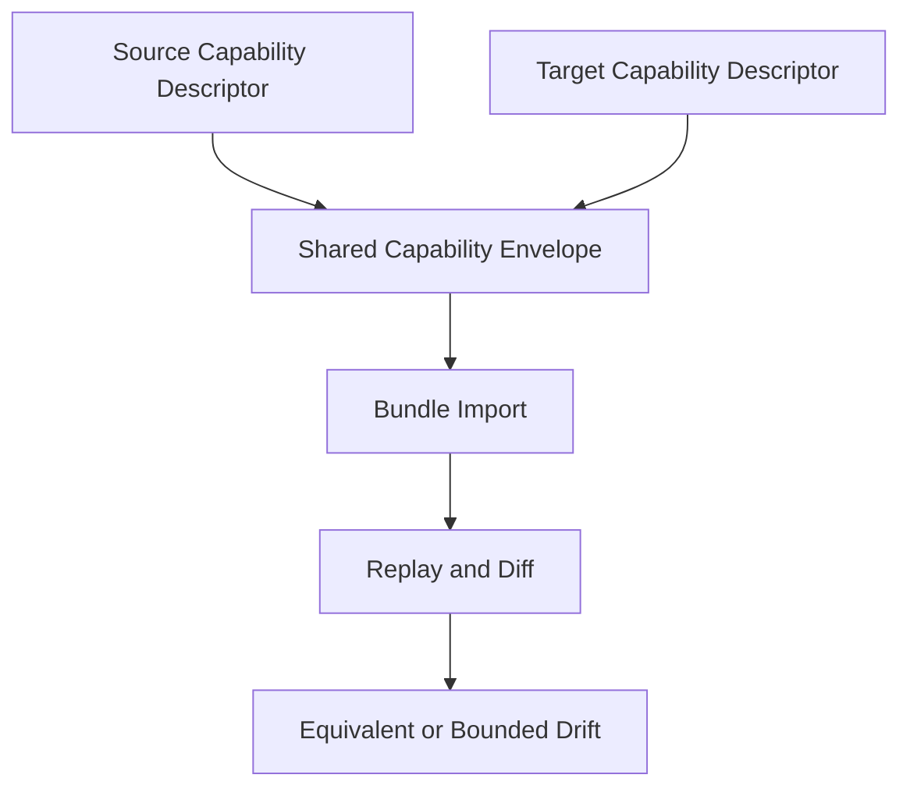

# Portability

Define portability architecture design, guarantees, and non-goals.

Portability determines how workflow context and outputs move across environments while preserving trust.

## Explanation
Portability architecture model:
- bundle export packages transferable workflow context
- bundle import restores that context in a target environment
- replay and diff validate behavioral equivalence or bounded divergence

Supported execution environment model:
- source and target environments are compared through capability descriptors, not marketing labels.
- portability acceptance depends on shared capability envelope across adapters.
- portability decisions are evidence-backed (replay + diff + identity consistency), not transfer-success backed.

Bundle portability design:
- portability is identity-aware and evidence-aware
- portability verification requires replay/diff, not assumption

Backend equivalence boundaries:
- supported adapters define the meaningful portability envelope
- unsupported adapter features are explicit non-equivalence zones

Architecture tradeoff:
- strict semantic preservation is prioritized over broad but ambiguous compatibility claims

Additional tradeoffs:
- tighter portability guarantees reduce number of environments that can claim equivalence.
- broader compatibility claims increase ambiguity and reduce diagnostic confidence.
- strict validation increases operational effort but prevents false confidence.

System non-goals (deliberate omissions):
- universal backend parity regardless of support boundaries
- performance identity across heterogeneous runtime environments
- speculative portability claims without validation workflows

Architecture-to-implementation alignment checks:
- portability docs must align with active backend support tiers in operations docs.
- portability claims must map to replay/diff classification vocabulary in specification docs.
- no architecture statement should assume capabilities not declared by adapter contracts.

## Examples
```text
Portability validation flow:
source run -> bundle export -> target import -> replay -> diff -> release decision
```

```text
Supported environment check example:
source adapter: local-shell (stable)
target adapter: local-shell (stable)
shared capability envelope: full for this workflow
portability decision path: replay + diff required before acceptance
```

```text
Bounded mismatch example:
source adapter supports timeout enforcement
target adapter lacks timeout enforcement
result: portability classified as bounded non-equivalence for timeout-sensitive workloads
```





## Guarantees
- Portability is documented as a validated workflow, not a blanket promise.
- Backend support boundaries are explicit architecture constraints.
- Supported-environment decision criteria are explicit and evidence-based.

## Limitations
- Portability does not guarantee identical timing or resource behavior.
- Deep bundle schema internals belong to specification docs.
- Portability acceptance can change when capability descriptors or support tiers change.

## Related
- `docs/05-system-architecture/05-adapters.md`
- `docs/03-user-guide/08-bundles-and-portability.md`
- `docs/07-operations/05-backend-support.md`
- `docs/06-specification/03-artifact-model.md`

## Portability classes

Portability should be classified explicitly:

- portable: replay and diff support equivalence decisions within declared support envelope,
- conditionally portable: transferable with bounded-equivalence limits,
- non-portable: capability gaps prevent trustworthy equivalence classification.

## Bundle portability versus backend equivalence

Bundle transport proves context transfer; it does not prove backend equivalence.

- bundle success + replay/diff equivalence -> accepted portability claim,
- bundle success + replay/diff drift -> portability claim rejected or downgraded,
- bundle success + incomplete replay -> bounded claim only.

## Portability failure and downgrade cases

Typical downgrade/failure triggers:

- missing adapter capability required by the workflow,
- incompatible canonicalization/hash policy versions,
- target environment constraints that block faithful execution.

When these occur, classify outcome as bounded or non-portable rather than forcing an equivalence conclusion.
