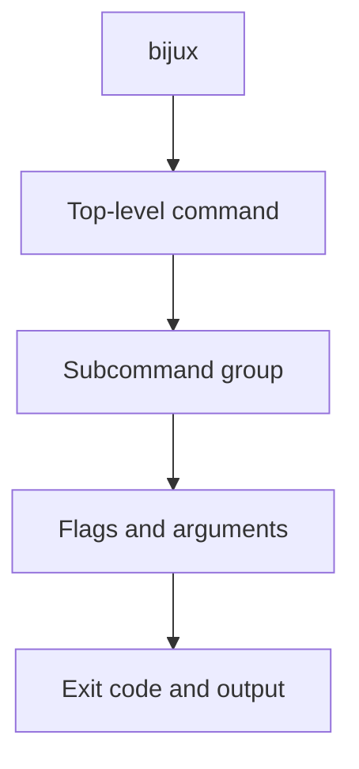
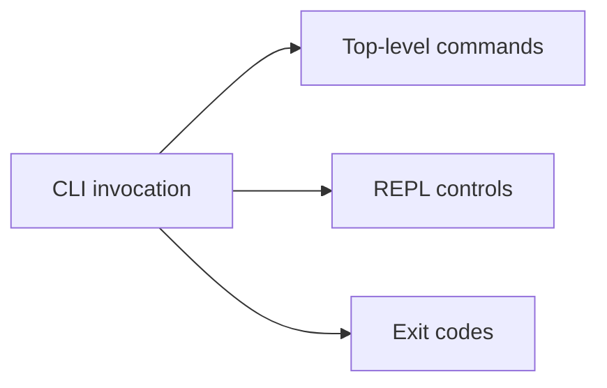

# Command Surface

## Purpose

This page lists the current command surface, key subcommand groups, REPL session
controls, and stable exit codes.

## Top-Level Commands

| Command | Purpose |
| --- | --- |
| `agent` | Bijux Agent runtime command proxy |
| `atlas` | Bijux Atlas runtime command proxy |
| `audit` | Diagnostics audit report |
| `config` | Configuration management |
| `dag` | Bijux DAG runtime command proxy |
| `dev` | Developer tools |
| `dna` | Bijux DNA runtime command proxy |
| `docs` | Documentation tools |
| `doctor` | Environment diagnostics |
| `gnss` | Bijux GNSS runtime command proxy |
| `help` | Global help |
| `history` | REPL history tools |
| `memory` | In-memory key/value tools |
| `plugins` | Plugin management |
| `rag` | Bijux RAG runtime command proxy |
| `rar` | Bijux RAR runtime command proxy |
| `repl` | Interactive shell |
| `sleep` | Sleep for a duration |
| `status` | CLI status probe |
| `version` | CLI version |
| `vex` | Bijux VEX runtime command proxy |

## Common Subcommand Groups

### `config`

`list`, `get`, `set`, `unset`, `export`, `load`, `reload`, `clear`

### `plugins`

`list`, `info`, `inspect`, `check`, `enable`, `disable`, `install`,
`uninstall`, `scaffold`, `doctor`, `reserved-names`, `where`, `explain`,
`schema`

### `history`

`clear`, `service`

### `memory`

`clear`, `delete`, `get`, `list`, `set`, `service`

### `dev`

`agent`, `atlas`, `dag`, `di`, `dna`, `gnss`, `list-products`,
`list-plugins`, `rag`, `rar`, `service`, `vex`

## REPL Session Controls

When using `bijux repl`, the documented session controls are:

- `:help <command>`
- `:set trace on|off`
- `:set quiet on|off`
- `:set format json|yaml|text`
- `:plugin reload`
- `:exit`

## Stable Exit Codes

| Code | Meaning |
| --- | --- |
| `0` | Success |
| `1` | Internal or general runtime failure |
| `2` | Usage or user-input error |
| `3` | Serialization, ASCII, or encoding error |
| `130` | User abort or interruption |

## Honest Limit

This page is a command inventory, not a full behavior tutorial. For usage
workflows, go to [User Guide](../03-user-guide/index.md).
