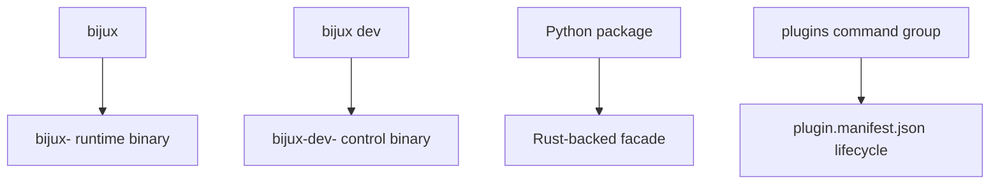

# Integrations And Routed Runtimes

## Purpose

This page records the reference facts for product binary routing, plugin
runtime behavior, Python facade APIs, and the remaining Python compatibility
baseline that still matters.

## Product Binary Routing

The `bijux` umbrella binary owns routed product execution.

| Surface | Binary pattern |
| --- | --- |
| Runtime route | `bijux <tool> ...` -> `bijux-<tool>` |
| Control-plane route | `bijux dev <tool> ...` -> `bijux-dev-<tool>` |

Known routed product namespaces are:

`agent`, `atlas`, `dag`, `dna`, `gnss`, `rag`, `rar`, `vex`

Configured product binary directories are checked before or after `PATH`
according to `BIJUXCLI_PRODUCT_BIN_PRECEDENCE`.

## Plugin Runtime Reference

The durable local plugin contract is based on `plugin.manifest.json`.

- local installs consume `plugin.manifest.json`
- delegated and Python plugins resolve their declared entrypoint from the
  installed manifest anchor when available
- `plugins inspect [plugin]` and `plugins doctor` report current-runtime drift
  and missing entrypoints
- compatibility is validated from `compatibility.min_inclusive` and
  `compatibility.max_exclusive`
- duplicate namespaces and alias conflicts are rejected during install

## Python Facade APIs

The current documented Python-facing facade exports:

- `version()`
- `command_tree_introspection()`
- `execution_facade(argv)`
- `output_envelope_model()`
- `error_to_exception(payload)`
- `config_resolution_helpers(home_dir)`
- `plugin_registry_inspection(registry_file)`
- `install_path_helpers(home_dir)`

The Python package is a Rust-backed compatibility surface, not a second
independent runtime.

## Current Python Compatibility Baseline

Compatibility review is still anchored on two comparisons:

1. current `bijux-cli` vs current `bijux-cli-python`
2. current `bijux-cli-python` vs the stable PyPI baseline still treated as the
   release-compatibility line

Historically retained Python-facing overlap still matters for:

- top-level command identity
- global flag behavior and precedence
- plugin command behavior
- REPL and completion expectations
- documented exit code meanings

## Honest Limit

This page describes supported routed and compatibility surfaces. It does not
claim that every historical Python implementation detail remains public or
stable.
