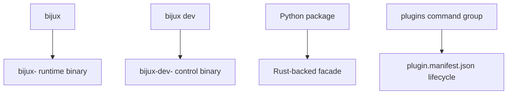

# Integrations And Routed Runtimes

## Purpose

This page records the reference facts for product binaries, plugin runtime
behavior, Python facade APIs, and the remaining Python compatibility baseline
that still matters.



This diagram shows the four integration surfaces that still matter in the
current repository: routed product commands, routed product control commands,
the Python facade, and the plugin lifecycle exposed through the runtime.


The second diagram explains the remaining compatibility chain. It shows why the
reference docs still talk about both the current Python package and the
configured stable PyPI baseline.

## Product Binary Routing

| Surface | Binary pattern |
| --- | --- |
| Routed runtime command | `bijux <tool> ...` |
| Routed control command | `bijux dev <tool> ...` |
| Runtime binary | `bijux-<tool>` |
| Control-plane binary | `bijux-dev-<tool>` |

Known routed product namespaces are:

`agent`, `atlas`, `dag`, `dna`, `gnss`, `rag`, `rar`, `vex`

Owned product binaries are discovered by executable name on `PATH`.

- `bijux <tool> ...` delegates to `bijux-<tool> ...`
- `bijux dev <tool> ...` delegates to `bijux-dev-<tool> ...`
- `bijux-dev-cli ...` remains the standalone maintainer surface for the CLI
  repository itself

The `bijux` runtime command contract stays separate from these maintainer and
product binaries, but it now owns both routed product entrypoints.

## Plugin Runtime Reference

The durable local plugin contract is based on `plugin.manifest.json`.

- local installs consume either a plugin directory root or `plugin.manifest.json`
- `plugins info`, `plugins`, and `plugins list` report registry-wide status,
  inventory counts, state totals, and current compatibility or load
  diagnostics
- delegated and Python plugins resolve their declared entrypoint from the
  installed manifest anchor when available, and they must declare that
  entrypoint as `module:callable`
- delegated and Python plugin execution requires Python 3.11 or newer on
  `PATH`
- `plugins inspect [plugin]` can report either one plugin or the full
  inventory, and `plugins doctor` reports current-runtime drift and missing
  entrypoints
- `plugins explain [plugin]` can report either a registry-wide summary or one
  plugin's compatibility and load diagnostics, including unknown or reserved
  references
- `plugins where` reports the active plugins directory and registry file
  together with existence and write-readiness hints
- `plugins reserved-names` reports the full blocked plugin namespace inventory,
  including official product namespaces and grouped ownership details, and
  confirms that the same policy applies to plugin aliases
- compatibility is validated from `compatibility.min_inclusive` and
  `compatibility.max_exclusive`
- duplicate namespaces and alias conflicts are rejected during install
- installed plugin namespaces and declared plugin aliases are executed as
  routed `bijux <plugin-command> ...` subcommands
- `python` and `delegated` plugins return structured payloads through the host
  renderer, while `external-exec` plugins keep their own stdout, stderr, and
  exit-code contract

## Python Facade APIs

The current documented Python-facing facade exports:

- `version()`
- `command_tree_introspection()`
- `execution_facade(argv)`
- `execution_facade_with_status(argv)`
- `output_envelope_model()`
- `error_to_exception(payload)`
- `config_resolution_helpers(home_dir)`
- `plugin_registry_inspection(registry_file)`
- `install_path_helpers(home_dir)`
- `migration_warnings()`
- `post_install_diagnostics()`

The Python package is a Rust-backed compatibility surface, not a second
independent runtime.

Relevant runtime-facing exceptions include:

- `PlatformWheelUnavailable`
- `NativeExtensionUnavailable`

## Local Product Routing

Adjacent Bijux product binaries can be invoked either through the routed
umbrella command or directly when their executables are discoverable.

Typical local setup:

```bash
export PATH="/path/to/product/bin:$PATH"
```

Examples:

```bash
bijux atlas --help
bijux dev atlas --help
bijux-atlas --help
bijux-dev-atlas --help
# from a workspace checkout
cargo run -q -p bijux-core-dev --bin bijux-dev-cli -- list-products --format json --no-pretty
```

The `list-products` output is the verification surface for known runtime and
control-plane product binaries.

## Current Python Compatibility Baseline

Compatibility review is still anchored on two comparisons:

1. current `bijux-cli` vs current `bijux-cli-python`
2. current `bijux-cli-python` vs the repository's configured stable PyPI
   baseline selected for the parity suite

Historically retained Python-facing overlap still matters for:

- top-level command identity
- global flag behavior and precedence
- plugin command behavior
- REPL and completion expectations
- documented exit code meanings

## Migration Notes That Still Matter

- the Python package now delegates command execution to the Rust runtime
- runtime resolution follows `BIJUX_BIN` first, then `bijux` on `PATH`
- compatibility warnings and post-install diagnostics exist to surface legacy
  Python-only assumptions
- if no usable runtime binary is found, the facade fails rather than silently
  inventing a second execution path

## Honest Limit

This page describes supported routed and compatibility surfaces. It does not
claim that every historical Python implementation detail remains public or
stable.
