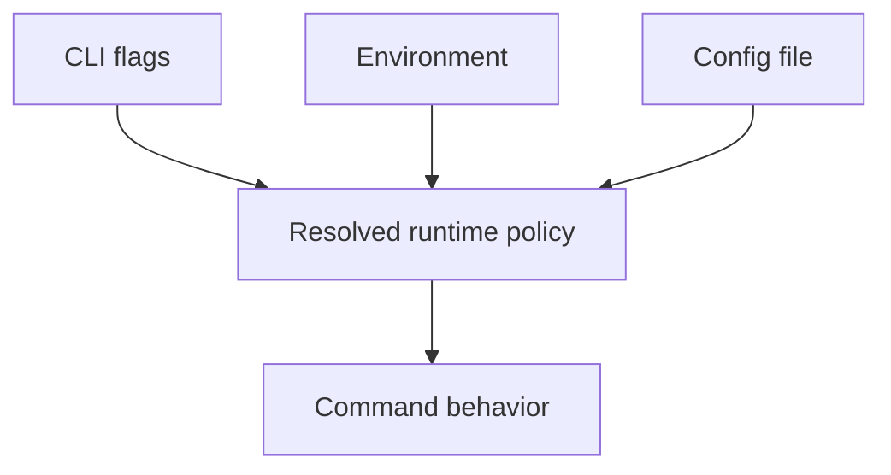
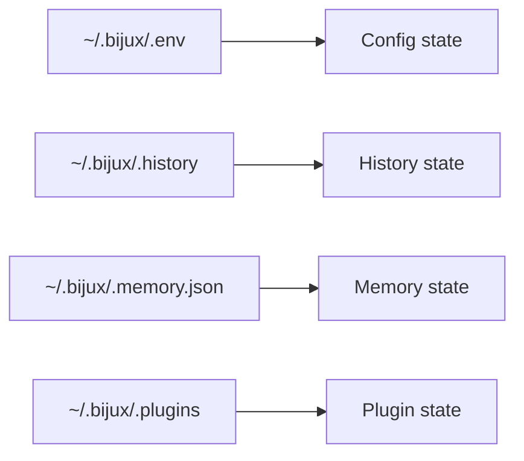

# State And Environment

## Purpose

This page lists the current configuration keys, default state paths, public
environment variables, and precedence rules that shape runtime behavior.

## Common Configuration Keys

| Key | Type | Meaning |
| --- | --- | --- |
| `format` | string | Output format: `text`, `json`, or `yaml` |
| `log_level` | string | Log level such as `trace`, `debug`, or `info` |
| `color` | string | Color mode: `auto`, `always`, or `never` |

These keys are ordinary runtime settings. They follow the documented
flags -> environment -> config -> defaults precedence chain.

## Default State Paths

| Surface | Default path |
| --- | --- |
| Config file | `~/.bijux/.env` |
| History file | `~/.bijux/.history` |
| Memory store | `~/.bijux/.memory.json` |
| Plugin directory | `~/.bijux/.plugins/` |

## Runtime Environment Variables

| Variable | Purpose |
| --- | --- |
| `BIJUXCLI_FORMAT` | Output format override |
| `BIJUXCLI_LOG_LEVEL` | Log level override |
| `BIJUXCLI_COLOR` | Color mode override |

`NO_COLOR=1` also affects color resolution.

## Compatibility Path Variables

These documented variables override filesystem paths, not ordinary runtime
settings:

| Variable | Purpose |
| --- | --- |
| `BIJUXCLI_CONFIG` | Config file path override |
| `BIJUXCLI_HISTORY_FILE` | History file path override |
| `BIJUXCLI_PLUGINS_DIR` | Plugin directory override |

These same keys are also the supported file-backed keys when the compatibility
config file stores path overrides.

## Bridge And Routing Variables

These variables are public because documented workflows depend on them, but
they do not behave like normal config/env precedence inputs:

| Variable | Purpose |
| --- | --- |
| `BIJUX_BIN` | Force the Python package or install diagnostics to use a specific runtime binary |

Maintainer binaries such as `bijux-dev-cli` and `bijux-dev-<tool>` are kept out
of the public runtime environment-variable surface documented here.

## Effective Precedence

For documented runtime behavior, precedence is:

1. CLI flags
2. environment variables
3. config file values
4. defaults

`quiet=true` forces the effective log level to `error`.
Compatibility path variables participate in the same precedence chain, but only
for path discovery.

## Honest Limit

This page lists public and documented state controls only. Test-only or
internal variables are not part of the supported reference surface.
