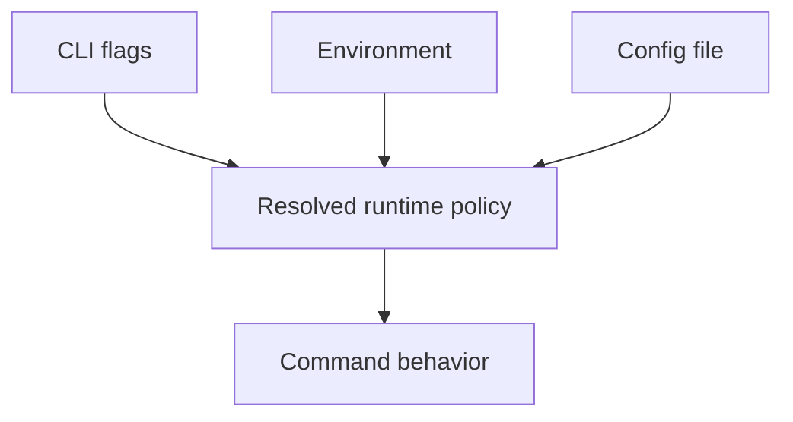
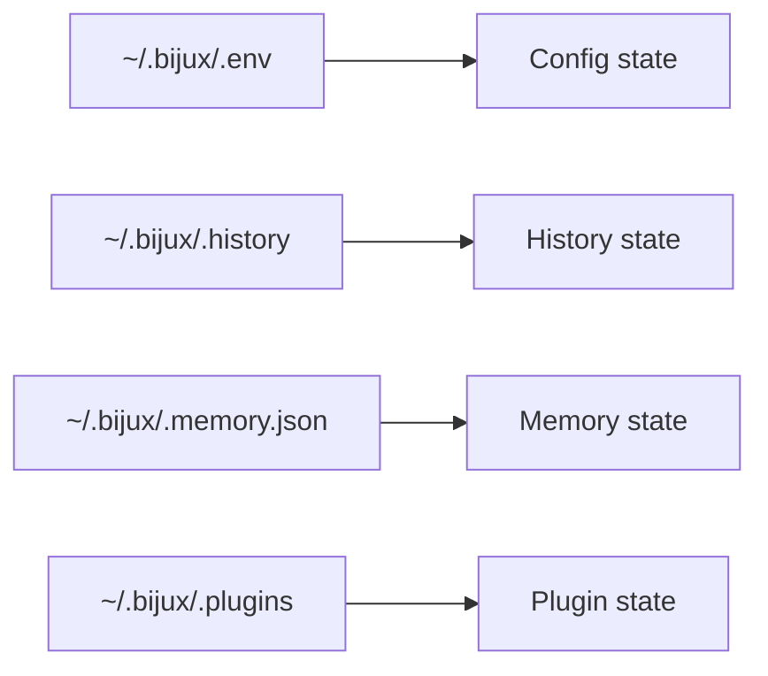

# State And Environment

## Purpose

This page lists the current configuration keys, default state paths, public
environment variables, and precedence rules that shape runtime behavior.

## Common Configuration Keys

| Key | Type | Meaning |
| --- | --- | --- |
| `format` | string | Structured output format: `json` or `yaml` |
| `log_level` | string | Log level such as `trace`, `debug`, or `info` |
| `color` | string | Color mode: `auto`, `always`, or `never` |

Config keys are stored in a dotenv-style file and are represented with an
uppercase `BIJUXCLI_` prefix when materialized in environment form.

## Default State Paths

| Surface | Default path |
| --- | --- |
| Config file | `~/.bijux/.env` |
| History file | `~/.bijux/.history` |
| Memory store | `~/.bijux/.memory.json` |
| Plugin directory | `~/.bijux/.plugins/` |

## Public Environment Variables

| Variable | Purpose |
| --- | --- |
| `BIJUXCLI_FORMAT` | Output format override |
| `BIJUXCLI_LOG_LEVEL` | Log level override |
| `BIJUXCLI_COLOR` | Color mode override |
| `BIJUXCLI_CONFIG` | Config file path override |
| `BIJUXCLI_HISTORY_FILE` | History file path override |
| `BIJUXCLI_PLUGINS_DIR` | Plugin directory override |
| `BIJUXCLI_ALLOWED_PRODUCT_BINS` | Allowlist for routed product binaries |
| `BIJUXCLI_PRODUCT_BIN_DIR` | Additional product binary directory |
| `BIJUXCLI_PRODUCT_BIN_DIRS` | Comma-separated additional binary directories |
| `BIJUXCLI_PRODUCT_BIN_PRECEDENCE` | Binary discovery order |
| `BIJUXCLI_ENFORCE_PRODUCT_MAJOR_MATCH` | Enforce routed product major-version checks when set to `1` |

`NO_COLOR=1` also affects color resolution.

## Effective Precedence

For documented runtime behavior, precedence is:

1. CLI flags
2. environment variables
3. config file values
4. defaults

`quiet=true` forces the effective log level to `error`.

## Honest Limit

This page lists public and documented state controls only. Test-only or
internal variables are not part of the supported reference surface.
