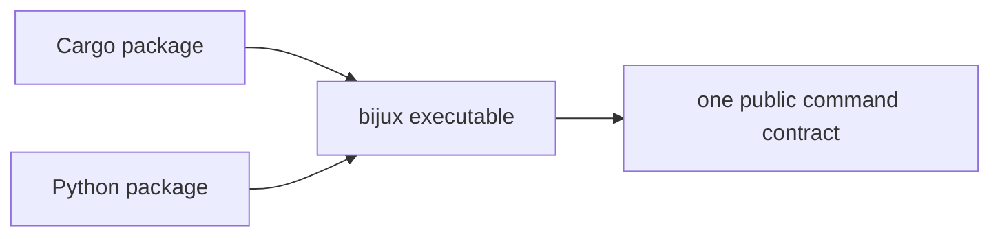
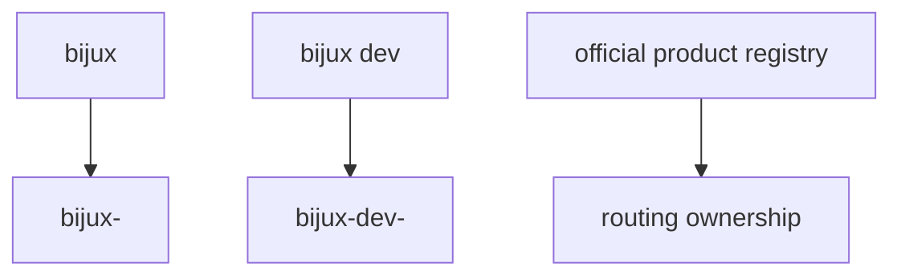

# Distribution And Ownership

## Purpose

This page defines package naming, binary ownership, routed product naming, and
the compatibility obligations of the Python distribution.

## Package Naming Contract

### Cargo

- canonical crate identity: `bijux-cli`
- compatibility alias channel: `bijux`
- both install channels must resolve to the same executable: `bijux`

### Python

- canonical distribution: `bijux-cli`
- compatibility or meta distribution: `bijux`
- both install names must resolve to the same user-facing `bijux` semantics

## Binary Ownership Rule

`bijux-cli` is the sole owner of the public `bijux` command contract.
Compatibility package names may exist, but they must delegate to the same
runtime behavior and must not publish divergent public executables.

## Routed Product Naming

- runtime tool binaries follow `bijux-<tool>`
- control-plane binaries follow `bijux-dev-<tool>`
- umbrella routing follows:
  - `bijux <tool> ...` -> `bijux-<tool>`
  - `bijux dev <tool> ...` -> `bijux-dev-<tool>`

The machine-readable routed product registry is
`docs/07-contracts/official_product_namespace_registry.json`.

## Python Distribution Policy

- the Python distribution is Rust-backed
- existing `pip install bijux-cli` users retain command-line compatibility
- wrappers must delegate to the same Rust command engine
- Python API changes require additive compatibility shims or explicit
  deprecation messaging

## Honest Limit

This contract defines ownership and routing boundaries. It does not promise
that every alias channel will exist forever without deprecation notice.
