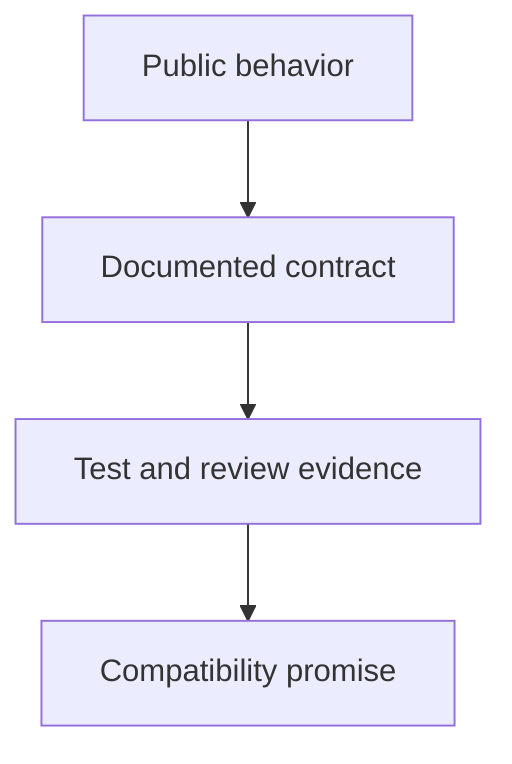
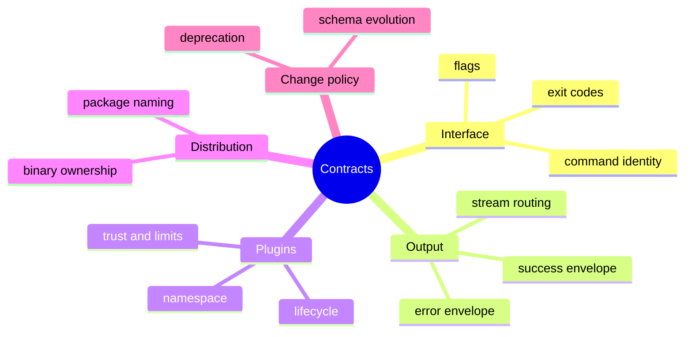

# Contracts

## Purpose

This section defines the public behavior promises that the repository is willing
to treat as binding. These are not explanations of implementation shape. They
are the promises users, automation, and integrations may rely on.

## Read This Set In Order

1. [Interface And Compatibility](interface-and-compatibility.md)
2. [Output And Stream Contracts](output-and-stream-contracts.md)
3. [Plugin Contracts](plugin-contracts.md)
4. [Distribution And Ownership](distribution-and-ownership.md)

## Scope

These pages are intentionally normative:

- they define what is promised, not merely what exists today
- they should be smaller and more stable than guides or architecture docs
- unsupported behavior should be named as unsupported, not implied as stable

## Next Step

If you need implementation shape, go to [Architecture](../04-architecture/index.md).
If you need exact lookup tables, go to [Reference](../06-reference/index.md).
