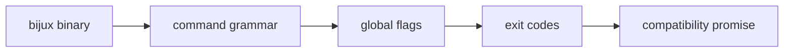
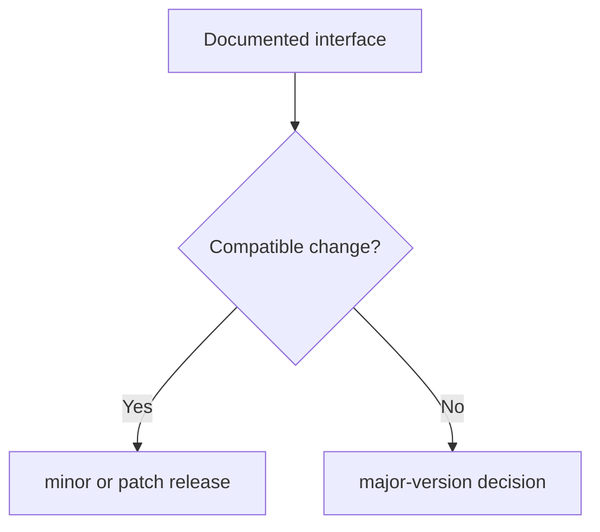

# Interface And Compatibility

## Purpose

This page defines the public interface identity, the stable command grammar
boundaries, the global flag contract, and the version-compatibility promise.

## Canonical Interface Identity

- `bijux` is the canonical public binary name
- `bijux-cli` is the sole owner of the `bijux` command contract
- the stable root entry forms include:
  - `bijux`
  - `bijux cli`

## Reserved Root Namespaces

The reserved root namespaces are:

`agent`, `atlas`, `audit`, `cli`, `config`, `dag`, `dev`, `dna`, `doctor`,
`docs`, `gnss`, `help`, `history`, `install`, `memory`, `plugins`, `rag`,
`rar`, `repl`, `status`, `version`, `completion`, `vex`

Plugins must not claim these namespaces.

## Stable Global Flags

The supported global flags are:

- `--help`
- `--version`
- `--format`
- `--pretty`
- `--no-pretty`
- `--quiet`
- `--log-level`
- `--color`
- `--config-path`

Precedence is stable and resolves as:

1. flags
2. environment
3. config
4. defaults

`--help` and `--version` are short-circuit flags.
`NO_COLOR=1` remains the documented color-suppression environment rule.

## Stable Exit-Code Meanings

- `0` success
- `1` internal failure
- `2` usage or input validation failure
- `3` encoding or serialization failure
- `130` interrupted by user signal

## Compatibility Promise

- documented contracts remain compatible within a major version
- incompatible contract changes require an explicit major-version decision
- undocumented incidental behavior is not part of the compatibility promise
- existing `bijux` aliases are not removed without deprecation notice

## Schema And Change Policy

- contract schemas are additive-first and versioned
- incompatible schema changes require a new versioned schema identifier
- current baselines are envelope `v1` and plugin manifest `v2`
- future changes must not repurpose existing documented fields with new meaning

Supporting schemas live under `contracts/schemas/`:

- `contracts/schemas/error-envelope-v1.schema.json`
- `contracts/schemas/output-envelope-v1.schema.json`
- `contracts/schemas/plugin-manifest-v2.schema.json`

Deprecation is a compatibility process:

- deprecated behavior remains functional during its announced window unless a
  security risk requires immediate action
- notices include replacement guidance and target removal version
- removal occurs only at the announced boundary

Stable deprecation message format:

`DEPRECATED: <subject> is deprecated and will be removed in <version>. Use <replacement>. Reference: <url>.`

## Honest Limit

This contract does not freeze every display detail, internal module boundary,
or undocumented parser quirk. It only covers documented public behavior.
