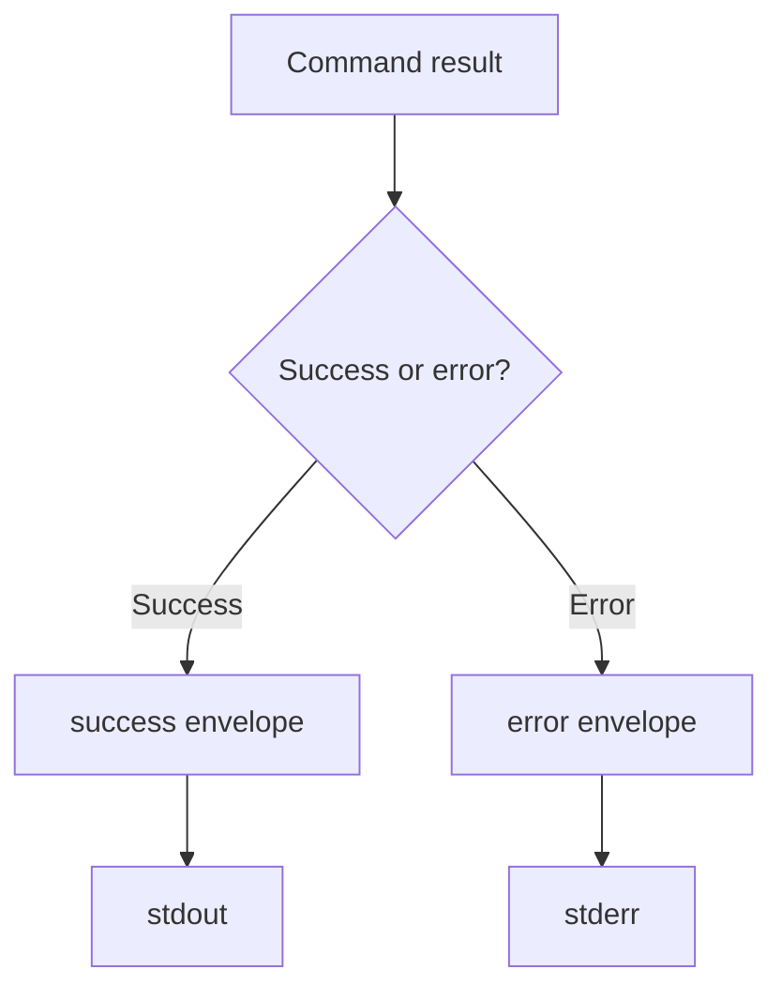
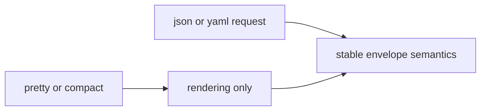

# Output And Stream Contracts

## Purpose

This page defines the stable success and error envelopes plus the stream-routing
rules that automation may rely on.

## Success Envelope Contract

Machine-readable success responses use this shape:

- `status`: fixed string `ok`
- `data`: command-specific payload object or array
- `meta.command.segments`: ordered canonical command namespace segments
- `meta.timestamp`: RFC 3339 timestamp
- `meta.version`: envelope version identifier

`--pretty` affects rendering only, not field meaning.

## Error Envelope Contract

Machine-readable error responses use this shape:

- `status`: fixed string `error`
- `error.code`: stable symbolic code
- `error.message`: user-readable summary
- `error.category`: one of `usage`, `validation`, `plugin`, `internal`
- `error.details`: optional structured context
- `meta.command.segments`: ordered canonical command namespace segments
- `meta.timestamp`: RFC 3339 timestamp
- `meta.version`: envelope version identifier

Exact message wording is not frozen, but the envelope semantics are.

## Stream Routing Rules

- success payloads go to `stdout`
- error payloads and fatal diagnostics go to `stderr`
- non-fatal debug logging goes to `stderr`
- one structured payload must not be split across both streams
- `--quiet` may suppress non-essential informational text, but not required
  machine-readable output

## Logging Semantics

- logging is diagnostic output, not command result data
- output-format flags affect payload rendering, not log policy
- log-level changes verbosity, not command semantics
- logging failures must not suppress command payloads or rewrite exit-code
  meanings

## Serialization Rule

If the requested structured format cannot be emitted, the command must fail with
the documented serialization or encoding exit behavior rather than silently
downgrading to another format.

## Machine-Readable Schemas

- success envelope schema: `contracts/schemas/output-envelope-v1.schema.json`
- error envelope schema: `contracts/schemas/error-envelope-v1.schema.json`

## Honest Limit

These contracts do not define every command-specific `data` field in one place.
They define the stable envelope and stream law around those payloads.
