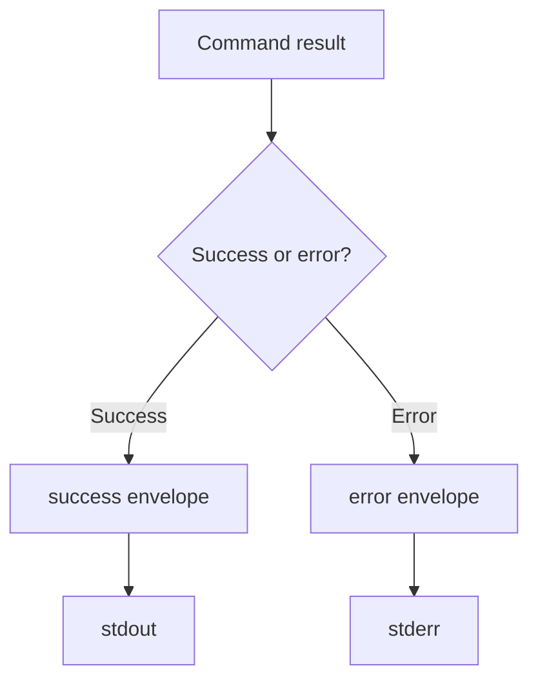
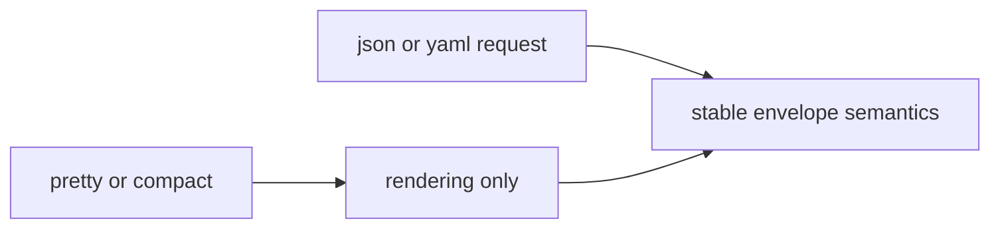

# Output And Stream Contracts

## Purpose

This page defines the stable success and error envelopes plus the stream-routing
rules that automation may rely on.

## Public CLI Success Contract

Ordinary runtime commands do not share one universal success wrapper.

Examples:

- `bijux status` returns a runtime snapshot object
- `bijux audit` returns audit checks and issues
- `bijux docs` returns a documentation inventory

The stable public rule is:

- successful machine-readable payloads go to `stdout`
- the payload shape is command-specific
- `--pretty` affects rendering only, not field meaning

## Public CLI Error Contract

The normal top-level CLI failure shape is a compact error object such as:

- `status`: fixed string `error`
- `code`: numeric exit-compatible error code
- `message`: user-readable summary
- `command`: normalized command string when known

Commands may add more fields, but they must not drop these core fields from the
standard CLI error surface.

## Schema Envelope Contract

The repository also keeps `output-envelope-v1` and `error-envelope-v1` schemas.
Those remain contract artifacts for compatibility and kernel-level envelope
behavior, but they are not the default wrapper around ordinary runtime commands
such as `status`, `audit`, `docs`, or `plugins list`.

When those schema envelopes are emitted:

- `meta.command.segments` records canonical command segments
- `meta.timestamp` is a Unix timestamp in milliseconds encoded as a string
- `meta.version` is the envelope version identifier

## Stream Routing Rules

- success payloads go to `stdout`
- error payloads and fatal diagnostics go to `stderr`
- non-fatal debug logging goes to `stderr`
- one structured payload must not be split across both streams
- `--quiet` may suppress non-essential informational text, but not required
  machine-readable output

## Logging Semantics

- logging is diagnostic output, not command result data
- output-format flags affect payload rendering, not log policy
- log-level changes verbosity, not command semantics
- logging failures must not suppress command payloads or rewrite exit-code
  meanings

## Serialization Rule

If the requested structured format cannot be emitted, the command must fail with
the documented serialization or encoding exit behavior rather than silently
downgrading to another format.

## Machine-Readable Schemas

- success envelope schema: `contracts/schemas/output-envelope-v1.schema.json`
- error envelope schema: `contracts/schemas/error-envelope-v1.schema.json`

## Honest Limit

These contracts do not define every command-specific `data` field in one place.
They define the stable envelope and stream law around those payloads.
