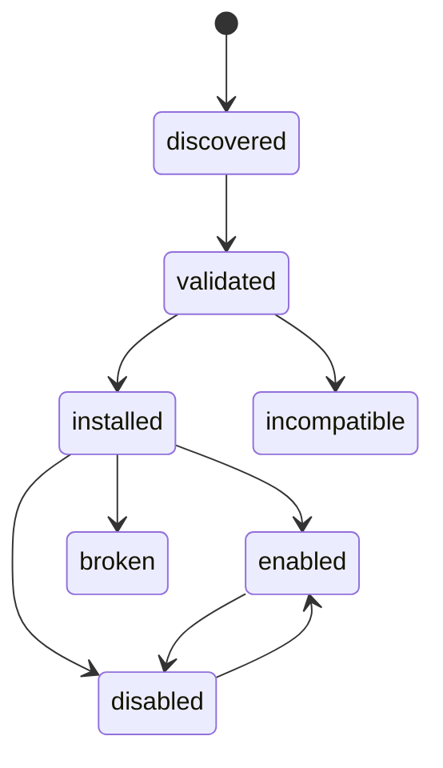
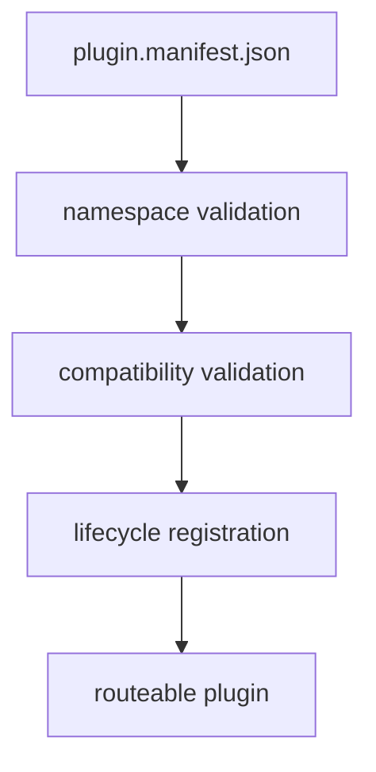

# Plugin Contracts

## Purpose

This page defines the public plugin contract: namespace rules, lifecycle terms,
supported kinds, and the hard limits users must understand before installing a
plugin.

## Namespace Rules

- plugins must not claim reserved root namespaces
- plugin namespaces are normalized to lowercase kebab-case
- namespace registration is rejected when it conflicts with built-ins or
  existing plugin namespaces
- case-insensitive collisions are rejected

## Lifecycle Terms

The stable lifecycle state terms are:

- `discovered`
- `validated`
- `installed`
- `enabled`
- `disabled`
- `broken`
- `incompatible`

These terms are stable for registry persistence and diagnostics.

## Manifest And Kind Policy

- the durable local plugin contract is based on `plugin.manifest.json`
- current manifest baseline is `v2`
- unknown major manifest versions are rejected
- supported executable kinds are `delegated`, `python`, and `external-exec`
- `native` is reserved for forward compatibility and is intentionally not
  executable today

## Trust And Safety Limits

- plugins are not sandboxed
- trust metadata may be surfaced as `core`, `verified`, `community`, or
  `unknown`
- capability and compatibility checks happen before activation
- broken and incompatible plugins must be diagnosed instead of silently treated
  as healthy

## Honest Limit

This contract governs plugin compatibility and lifecycle behavior. It does not
claim that plugin code is safe merely because it is installable.
