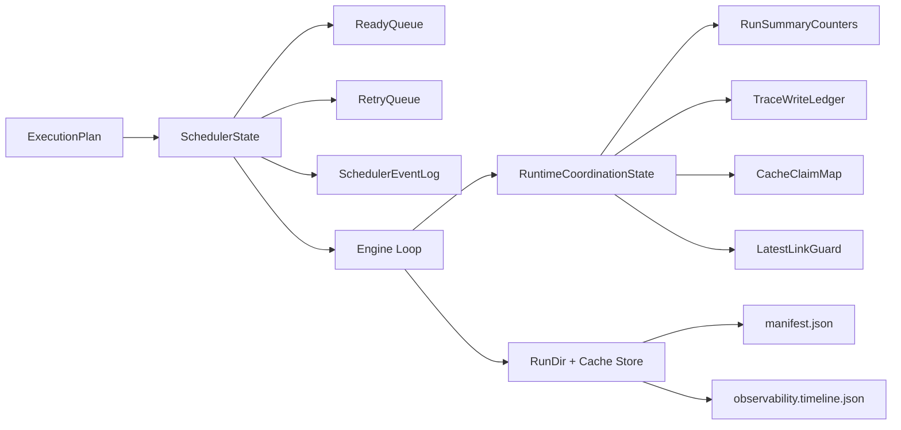

# Runtime Concurrency Boundaries

## Boundaries

- `SchedulerState` owns readiness transitions and scheduling event ordering.
- `RuntimeCoordinationState` owns concurrent mutation guards shared by worker
  paths.
- Storage writers are invoked after coordination checks and remain outside
  scheduler internals.

## Non-goals

- No lock-free shared mutable state.
- No implicit cross-module mutation without ownership API.
