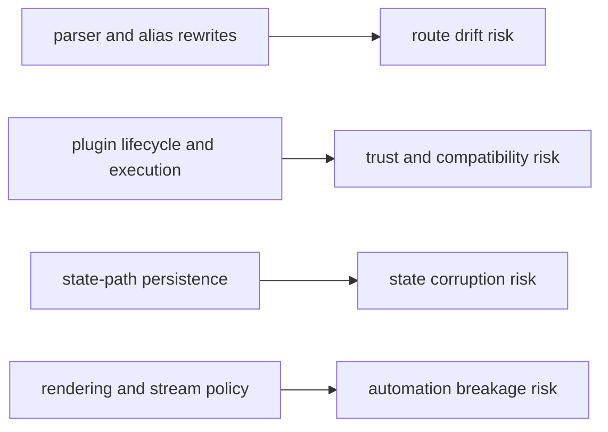

# Architecture Risks

This page records high-impact architectural risks where regressions are likely
if changes are merged without explicit checks.

## Visual Summary

## Risk Areas

- parser and alias changes can silently break automation paths
- plugin namespace rules can regress and allow collisions or ambiguous routes
- persistence mutations can corrupt config/history/registry state
- output formatting changes can break machine consumers
- delegation behavior can hide failures when external tools are unavailable

## Code Anchors

- `crates/bijux-cli/src/routing/parser.rs`
- `crates/bijux-cli/src/routing/model.rs`
- `crates/bijux-cli/src/features/plugins/registry.rs`
- `crates/bijux-cli/src/features/config/storage.rs`
- `crates/bijux-cli/src/interface/cli/dispatch.rs`

## Mitigation Checklist

- add or update routing law and parser regression tests
- verify structured output snapshots for changed command surfaces
- run plugin lifecycle integration tests for install/enable/disable/uninstall
- validate state diagnostics after persistence logic changes

## Next Reads

- [Risk Register](../quality/risk-register.md)
- [Test Strategy](../quality/test-strategy.md)
- [Change Validation](../quality/change-validation.md)
