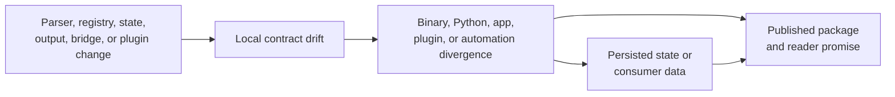

# CLI Architecture Risks

These risks can make a command appear functional while breaking automation,
extension ownership, or recoverability. The table names the first detection
route, not every test required by a broad change.

## Failure Propagation

A focused command can still appear healthy while drift propagates through a
different entrypoint or retained state. Detection therefore follows the
contract surface, not only the edited module.

## Risk Register

| Risk | Observable failure | Detection authority | Release decision |
| --- | --- | --- | --- |
| route-law drift | an alias, built-in, mounted app, and plugin resolve by different rules | `routing::laws`, parser fixtures, and command-tree snapshots | block release until every entrypoint follows one route law |
| namespace capture | an extension shadows a built-in, official product, hidden alias, or normalized peer | `registry_namespace_policy`, `registry_resolution`, and `plugin_namespace_law` | block plugin-capable releases |
| registration nondeterminism | plugin install order changes help, suggestions, route ownership, or JSON inventory | `route_registry_stability` and `plugin_discovery_ordering_laws` | block release; persisted order is not an acceptable workaround |
| envelope divergence | human and JSON modes disagree, required fields disappear, or failures use the success stream/status | `envelope_compatibility`, `sdk_surface`, and `bin_core_integration` | block every affected distribution |
| partial state mutation | failed install, uninstall, or config write leaves registry and filesystem claims inconsistent | plugin rollback/resilience and state diagnostic tests | block release until retry or repair is deterministic |
| bridge semantic split | Python installation or mounted apps expose behavior different from the Rust runtime | Python bridge ownership and equivalence contracts | block Python publication and any shared release claim |
| plugin trust overstatement | docs or diagnostics imply that installed plugin code is sandboxed | security documentation contracts and lifecycle tests | correct the claim before release; plugin execution remains a trust decision |
| state-path ambiguity | the same invocation resolves different config, history, memory, or registry locations without an explained origin | path resolution, config origin, state diagnostics, and environment-isolation contracts | block state-affecting release until the effective path is attributable |
| delegated-tool confusion | root routing presents an unavailable or incompatible external product as built-in success | known-tool discovery, delegation, and missing-executable contracts | block the affected integration claim; keep product ownership explicit |

## Required Evidence By Change

### Routing and aliases

Show that equivalent argv forms normalize to the same route, malformed input
does not panic, command-tree output is stable, and unknown-command suggestions
do not depend on registration order.

### Plugins and mounted apps

Show namespace refusal, compatibility validation, install/inspect/execute/remove
lifecycle behavior, rollback after failed mutations, and stable machine-readable
diagnostics. A scaffold test alone does not prove installed execution safety.

### State and persistence

Show the resolved path, mutation boundary, atomicity or rollback behavior, and a
diagnostic route for damaged state. Deleting state until a test passes is not a
recovery contract.

### Output and errors

Show the serialized envelope, human rendering, stdout/stderr selection, and
exit code for success and failure. Snapshot updates require semantic review;
accepting new output mechanically is not evidence of compatibility.

### Distribution and bridge

Show source-tree and installed behavior for the Rust binary and Python
distribution, including version identity, representative command envelopes,
streams, and exit codes. A passing Rust unit test does not prove wheel contents
or launcher resolution.

## Detect, Contain, Recover

| Risk class | Containment | Recovery proof |
| --- | --- | --- |
| routing or namespace | disable the new registration or refuse the collision | stable route inventory, help, suggestions, and equivalent argv results |
| persisted state | stop mutation and preserve original files plus resolved paths | atomic/rollback test, diagnostics, and successful retry from a known state |
| envelope or bridge | stop publication of every affected distribution | schema tests plus source-tree and installed-boundary parity |
| plugin execution | disable the record without deleting investigation evidence | route refusal, credential response, inspected source, and explicit re-enablement decision |
| delegated product | remove or narrow the integration claim | missing/incompatible tool behavior and owning product smoke proof |

Do not use deletion, snapshot acceptance, an undocumented alias, or a broad
retry as containment. Those actions can erase the evidence needed to identify
the owner.

## Residual Trust Boundary

Installed plugins execute with the invoking user's privileges and are not
sandboxed. Namespace checks, manifest validation, and lifecycle rollback
protect routing and state integrity; they do not make untrusted plugin code
safe. See [Security and Safety](../operations/security-and-safety.md) before
changing installation or execution behavior.

## Escalation

If a risk cannot be removed for the current release, record it in the
[CLI Risk Register](../quality/risk-register.md) with affected commands,
impact, mitigation, and release decision. Do not convert a failing contract
into an undocumented exception or broaden a success claim beyond the evidence
that passed.

## Release Acceptance

Before accepting a risk-sensitive change, connect the affected public claim to
its owner, schema or compatibility contract, adversarial proof, installed
distribution evidence, documentation, and any migration. Unknown or
unexercised entrypoints narrow the release claim; they do not inherit success
from another surface.

## Verification Sources

- `crates/bijux-cli/tests/routing/`
- `crates/bijux-cli/tests/integration/cli/plugins/`
- `crates/bijux-cli/tests/integration/cli/root/bin_core_integration.rs`
- `crates/bijux-cli/tests/architecture/`
- [Test Strategy](../quality/test-strategy.md)
