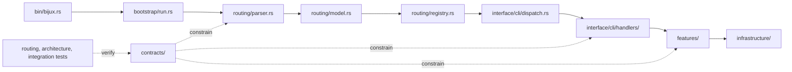

# Code Navigation

Read `bijux-cli` from an owned behavior toward its effects, not from whichever
file happens to contain a matching string. Parsing, route resolution, command
presentation, feature policy, and infrastructure are separate review
boundaries. A change is incomplete when it alters one boundary without checking
the contracts at the next boundary.

## Dependency Direction

The arrows show normal control and dependency direction. Tests may construct
lower-level objects directly, but product code must not route infrastructure
concerns back into parser or contract ownership.

## Find The Owning Surface

| Question | Start here | Confirm with |
| --- | --- | --- |
| why is argv accepted or rejected? | `src/routing/parser.rs` | `tests/routing/parser/` and routing snapshots |
| why did a spelling resolve to this route? | `src/routing/model.rs`, `src/routing/registry.rs` | `tests/routing/contracts/` and `tests/routing/laws/` |
| why is help or output shaped this way? | `src/interface/cli/dispatch.rs`, `src/interface/cli/help.rs` | interface architecture tests and integration goldens |
| where does a command acquire dependencies? | `src/bootstrap/run.rs` | bootstrap and root integration tests |
| which module owns user-visible behavior? | the matching module under `src/features/` | the matching integration suite under `tests/integration/cli/` |
| where are filesystem and process effects implemented? | `src/infrastructure/` | resilience and architecture boundary tests |
| what can Rust callers rely on? | `src/api/`, `src/sdk/`, `src/contracts/` | public API and contract suites |
| how does interactive behavior differ? | `src/interface/repl/` | `tests/integration/repl/` |

Paths in the table are relative to `crates/bijux-cli/`.

## Trace A Command Change

For a new spelling or changed command contract, review in this order:

1. define or confirm the stable contract in `src/contracts/`;
2. update parser, route model, and registry ownership;
3. update dispatch, help, and the owning handler;
4. change feature policy without leaking presentation into the feature;
5. keep external effects behind infrastructure adapters;
6. update routing laws, snapshots, architecture tests, and focused integration
   coverage.

A handler-only patch is usually insufficient for a command-surface change. It
can leave help, aliases, REPL completion, machine output, or route laws out of
sync.

## Generated And Persisted Surfaces

Do not hand-edit generated config reference material or golden output to make a
test pass. Find the producer in `src/features/config/` or the relevant command
presentation code, regenerate through the repository-owned command, and review
the semantic diff. Persistent state formats belong to feature contracts and
compatibility tests, not to command handlers.

## Review Evidence

| Change | Minimum focused evidence |
| --- | --- |
| parser or alias behavior | routing parser, contract, and law suites |
| help or output fields | interface tests plus affected golden snapshots |
| feature state mutation | focused integration tests including refusal and recovery |
| infrastructure effect | architecture boundary test plus integration coverage |
| public Rust surface | API contract tests and documentation build |
| Python parity | Rust integration evidence plus the Python package parity suite |

## Next Reads

- [Module Map](module-map.md)
- [Dependency Direction](dependency-direction.md)
- [Entrypoints and Examples](../interfaces/entrypoints-and-examples.md)
- [Review Checklist](../quality/review-checklist.md)
