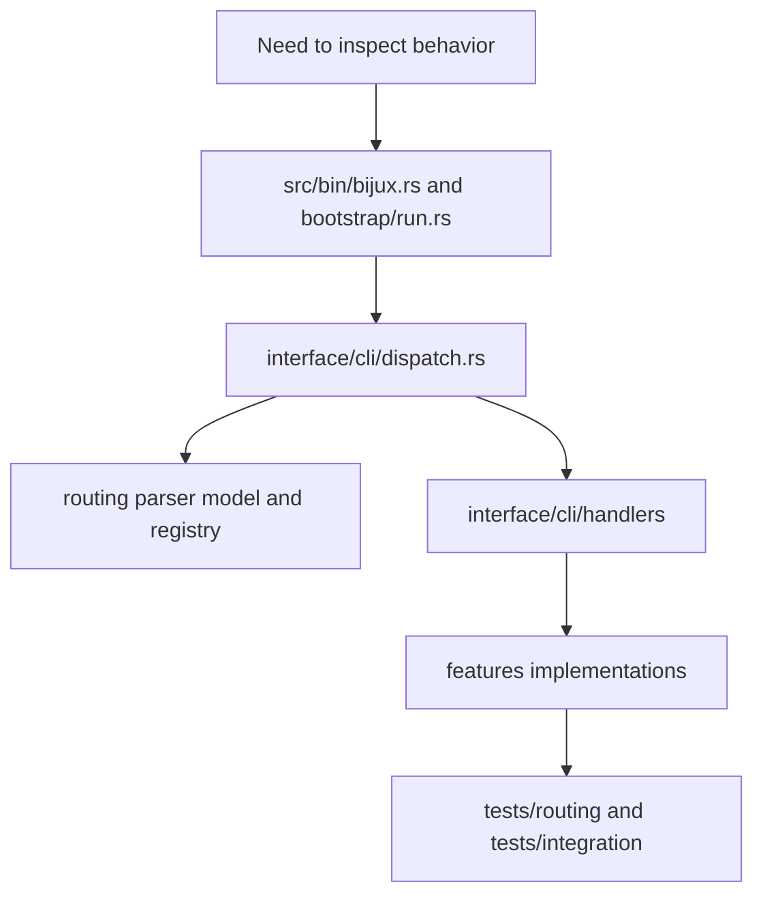

# Code Navigation

This page provides practical entry points for reading `bijux-cli` source without
starting from random files.

## Visual Summary

## Navigation Paths by Question

- command grammar and help behavior: `src/routing/parser.rs`
- route ownership and alias rewrites: `src/routing/model.rs`, `src/routing/registry.rs`
- command dispatch and output policy: `src/interface/cli/dispatch.rs`
- command handlers: `src/interface/cli/handlers/`
- feature implementation: `src/features/`
- REPL behavior: `src/interface/repl/`

## Test Navigation

- routing contracts: `crates/bijux-cli/tests/routing/`
- integration suites: `crates/bijux-cli/tests/integration/`
- architecture boundaries: `crates/bijux-cli/tests/architecture/`

## Review Shortcut

For most behavior changes, read in this order:

1. parser/model change
2. dispatch and handler impact
3. feature implementation change
4. routing/integration test updates

## Next Reads

- [Module Map](module-map.md)
- [Entrypoints and Examples](../interfaces/entrypoints-and-examples.md)
- [Review Checklist](../quality/review-checklist.md)
